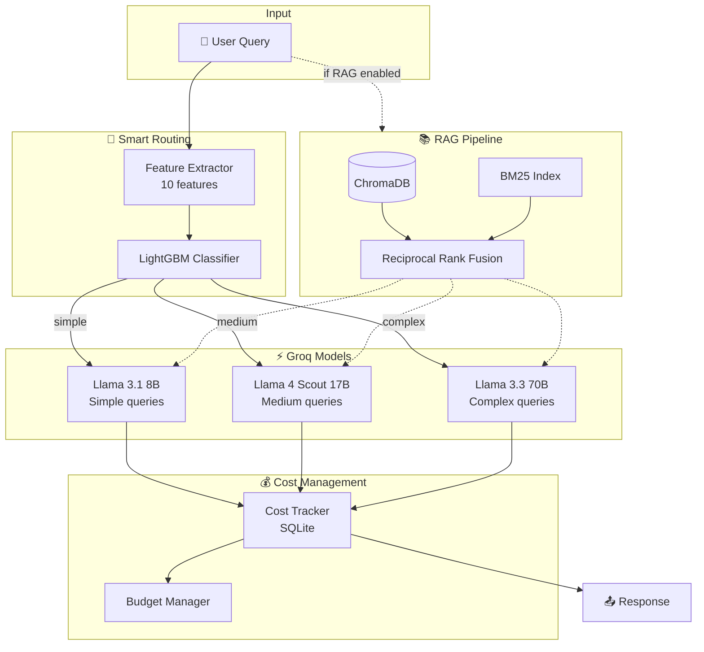
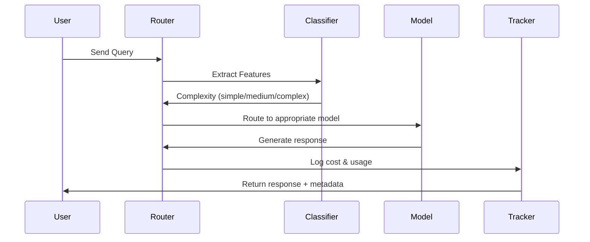

# 🚀 SmartRoute-AI

**Cost-Optimized LLM Routing System with RAG**

> Intelligently routes queries to the most cost-effective model while maintaining quality. Uses Groq's **free API** for 100% cost savings.


---

## 🎯 Features

- **Smart Routing** - ML classifier routes queries to optimal models based on complexity
- **Tiered Models** - Simple → 8B, Medium → 17B, Complex → 70B
- **RAG Integration** - Hybrid search with ChromaDB + BM25
- **Cost Tracking** - Real-time monitoring with budget alerts
- **Dashboard** - Streamlit analytics UI

---

## 🏗️ Architecture



---

## 📁 Project Structure

```
SmartRoute-AI/
├── api/
│   └── main.py              # FastAPI endpoints
├── app.py                   # Streamlit dashboard
├── config/
│   ├── models.yaml          # Model configurations
│   └── routing.yaml         # Routing strategies & budgets
├── src/
│   ├── routing/
│   │   ├── router.py        # Query router
│   │   ├── classifier.py    # LightGBM complexity classifier
│   │   └── features.py      # Feature extraction (10 features)
│   ├── models/
│   │   ├── model_manager.py # Model loading & caching
│   │   └── groq_model.py    # Groq API wrapper
│   ├── retrieval/
│   │   ├── retriever.py     # Hybrid retrieval (dense + sparse)
│   │   ├── vector_store.py  # ChromaDB wrapper
│   │   ├── embedder.py      # HuggingFace embeddings
│   │   ├── indexer.py       # Document indexing
│   │   └── chunking.py      # Text chunking
│   ├── pipeline/
│   │   └── inference.py     # Main orchestration pipeline
│   ├── cost/
│   │   ├── tracker.py       # Cost logging (SQLite)
│   │   └── budget.py        # Budget management
│   └── utils/
│       └── logger.py        # Logging configuration
├── scripts/
│   └── train_classifier.py  # Train complexity classifier
├── tests/                   # Pytest tests
├── data/
│   ├── documents/           # RAG documents
│   └── embeddings/          # ChromaDB persistence
└── models/
    └── classifiers/         # Trained classifier
```

---

## 🚀 Quick Start

### 1. Clone & Setup

```bash
git clone https://github.com/yourusername/SmartRoute-AI.git
cd SmartRoute-AI

# Create environment
conda create -n SmartRoute-AI python=3.10 -y
conda activate SmartRoute-AI

# Install dependencies
pip install -r requirements.txt
```

### 2. Get Groq API Key (FREE)

1. Go to [console.groq.com/keys](https://console.groq.com/keys)
2. Create a free account and generate API key
3. Setup environment:

```bash
cp .env.example .env
# Add your key: GROQ_API_KEY=gsk_xxxxx
```

### 3. Train Classifier

```bash
python scripts/train_classifier.py
```

### 4. Run

**Streamlit Dashboard:**
```bash
streamlit run app.py
# Open http://localhost:8501
```

**FastAPI Server:**
```bash
uvicorn api.main:app --reload
# Open http://localhost:8000/docs
```

---

## 🔄 How It Works



---

## 📊 API Endpoints

| Endpoint | Method | Description |
|----------|--------|-------------|
| `/health` | GET | Health check |
| `/query` | POST | Process query |
| `/stats` | GET | Get usage statistics |
| `/models` | GET | List available models |

### Example Request

```bash
curl -X POST "http://localhost:8000/query" \
  -H "Content-Type: application/json" \
  -d '{"query": "What is machine learning?", "strategy": "cost_optimized"}'
```

---

## ⚙️ Configuration

### Routing Strategies

| Strategy | Description |
|----------|-------------|
| `cost_optimized` | Minimize cost, use smallest suitable model |
| `quality_first` | Maximize quality, use larger models |
| `balanced` | Balance between cost and quality |

### Model Tiers

| Complexity | Model | Speed |
|------------|-------|-------|
| Simple | Llama 3.1 8B | ~560 tok/sec |
| Medium | Llama 4 Scout 17B | ~400 tok/sec |
| Complex | Llama 3.3 70B | ~280 tok/sec |

---

## 🧪 Testing

```bash
pytest tests/ -v
```

---

## 🐳 Docker

```bash
docker-compose up --build
```

With dashboard:
```bash
docker-compose --profile dashboard up --build
```

---

## 🚀 Render Deployment

### Option 1: Blueprint (Recommended)

1. Push your code to GitHub
2. Go to [Render Dashboard](https://dashboard.render.com)
3. Click **New** → **Blueprint**
4. Connect your GitHub repository
5. Render will auto-detect `render.yaml` and create **both services**:
   - `smartroute-api` - FastAPI backend
   - `smartroute-dashboard` - Streamlit UI
6. Add your environment variables:
   - `GROQ_API_KEY`: Your Groq API key (required)

### Option 2: Manual Deployment

**Deploy API Service:**
1. Go to [Render Dashboard](https://dashboard.render.com)
2. Click **New** → **Web Service**
3. Connect your GitHub repository
4. Configure settings:
   - **Name**: `smartroute-api`
   - **Runtime**: Docker
   - **Dockerfile Path**: `./Dockerfile`
   - **Branch**: `main`
   - **Plan**: Free (or your preferred tier)
5. Add environment variables:
   - `GROQ_API_KEY`: Your Groq API key
   - `DAILY_BUDGET`: `10.0`
   - `WEEKLY_BUDGET`: `50.0`
   - `MONTHLY_BUDGET`: `200.0`
   - `ALLOWED_ORIGINS`: `*`
6. Click **Create Web Service**

**Deploy Dashboard Service:**
1. Click **New** → **Web Service** again
2. Configure settings:
   - **Name**: `smartroute-dashboard`
   - **Runtime**: Docker
   - **Dockerfile Path**: `./Dockerfile.streamlit`
   - **Branch**: `main`
   - **Plan**: Free
3. Add the same environment variables as above
4. Click **Create Web Service**

### Post-Deployment URLs

| Service | URL |
|---------|-----|
| **API** | `https://smartroute-api.onrender.com` |
| **Dashboard** | `https://smartroute-dashboard.onrender.com` |

Test the API health:
```bash
curl https://smartroute-api.onrender.com/health
```

---

## 📦 Dependencies

| File | Purpose |
|------|---------|
| `requirements.txt` | Production dependencies |
| `requirements-dev.txt` | Development + testing tools |

Install for development:
```bash
pip install -r requirements-dev.txt
```

---

## 🤝 Contributing

1. Fork the repository
2. Create a feature branch
3. Make your changes
4. Run tests
5. Submit a pull request

---

## 📜 License

MIT License - see [LICENSE](LICENSE) for details.
