# 🚀 SmartRoute-AI

### **AI-Powered Cost Optimization for LLM Inference at Scale**

> **Intelligent query routing system that reduces LLM costs by ~70% while maintaining quality** through ML-based complexity classification, semantic feature engineering, and Reciprocal Rank Fusion (RRF) hybrid RAG retrieval.

[Live Demo](https://smartroute-ai.streamlit.app)


---

## 🎯 The Problem

**Challenge**: Teams waste 60ΓÇô80% on LLM API costs by:
- Routing ALL queries to the most expensive model (GPT-4, Claude-3, Llama-70B)
- No intelligence in model selection ΓÇö "one size fits all"
- No cost tracking or budget guardrails
- Retrieval systems that combine results naively (append, not rank)

**Solution**: SmartRoute-AI dynamically routes each query to the optimal model tier (8B / 17B / 70B) using a LightGBM classifier with semantic features, enforces real-time budget limits, and retrieves context using weighted Reciprocal Rank Fusion.

---

## ✨ Key Features

### **1. Intelligent Query Routing** 🧠
- **LightGBM Classifier**: Predicts query complexity (simple / medium / complex)
- **Semantic Features**: `SentenceTransformer` similarity against reference queries ΓÇö not just word count
- **Multi-Strategy**: `cost_optimized`, `quality_first`, `balanced` routing
- **Confidence Escalation**: Routes to higher tier when classification confidence is low
- **Budget-Aware**: Automatic fallback to cheapest model when daily limit is near

### **2. Hybrid RAG with RRF** 📚
- **Dense Retrieval**: Sentence-BERT embeddings with ChromaDB
- **Sparse Retrieval**: BM25 for exact keyword matching
- **Reciprocal Rank Fusion**: Combines ranked lists by score ΓÇö not naive append
- **Optimized Chunking**: Smart document splitting with overlap

### **3. Real-Time Cost Analytics** 💰
- **Token-Level Tracking**: Precise cost calculation per query (input + output tokens)
- **Query Hashing**: SHA-256 hash per query for deduplication and audit
- **Budget Management**: Daily/weekly/monthly limits ΓÇö checked directly against DB (no stale cache)
- **Savings Analysis**: Real-time comparison vs. always-70B baseline

### **4. Production-Ready Infrastructure** 🏗️
- **FastAPI Backend**: RESTful API with rate limiting
- **Streamlit Dashboard**: Interactive analytics UI
- **Docker Containerized**: One-command deployment
- **CI/CD Pipeline**: GitHub Actions → Docker Hub

---

## 🏗️ Architecture

### **System Overview**

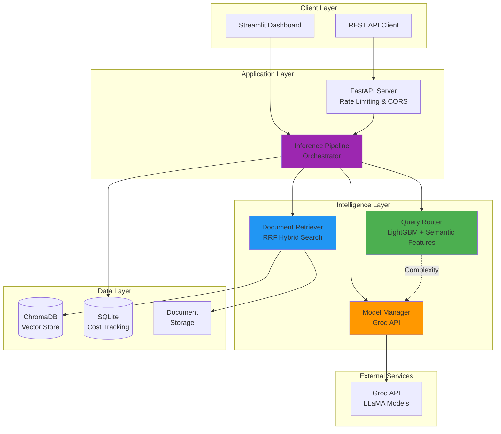
```mermaid
graph TB
    subgraph "Client Layer"
        UI[Streamlit Dashboard]
        API[REST API Client]
    end
    
    subgraph "Application Layer"
        FastAPI[FastAPI Server<br/>Rate Limiting & CORS]
        Pipeline[Inference Pipeline<br/>Orchestrator]
    end
    
    subgraph "Intelligence Layer"
        Router[Query Router<br/>LightGBM + Semantic Features]
        Retriever[Document Retriever<br/>RRF Hybrid Search]
        ModelMgr[Model Manager<br/>Groq API]
    end
    
    subgraph "Data Layer"
        ChromaDB[(ChromaDB<br/>Vector Store)]
        SQLite[(SQLite<br/>Cost Tracking)]
        Docs[Document<br/>Storage]
    end
    
    subgraph "External Services"
        Groq[Groq API<br/>LLaMA Models]
    end
    
    UI --> Pipeline
    API --> FastAPI
    FastAPI --> Pipeline
    
    Pipeline --> Router
    Pipeline --> Retriever
    Pipeline --> ModelMgr
    
    Router -.->|Complexity| ModelMgr
    Retriever --> ChromaDB
    Retriever --> Docs
    ModelMgr --> Groq
    
    Pipeline --> SQLite
    
    style Router fill:#4CAF50
    style Retriever fill:#2196F3
    style ModelMgr fill:#FF9800
    style Pipeline fill:#9C27B0
```

### **Query Processing Flow**

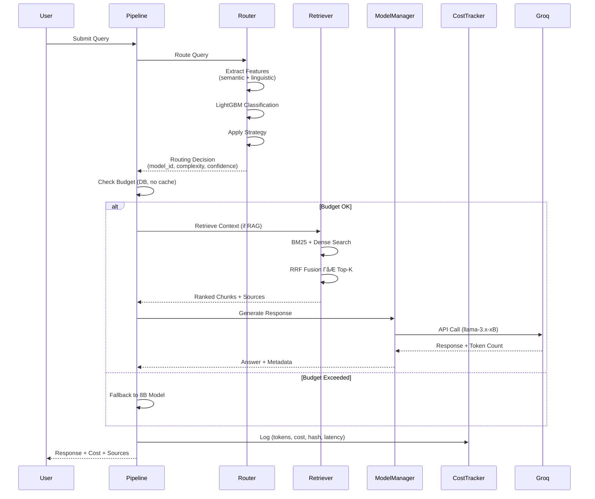
```mermaid
sequenceDiagram
    participant User
    participant Pipeline
    participant Router
    participant Retriever
    participant ModelManager
    participant CostTracker
    participant Groq

    User->>Pipeline: Submit Query
    
    Pipeline->>Router: Route Query
    Router->>Router: Extract Features<br/>(semantic + linguistic)
    Router->>Router: LightGBM Classification
    Router->>Router: Apply Strategy
    Router-->>Pipeline: Routing Decision<br/>(model_id, complexity, confidence)
    
    Pipeline->>Pipeline: Check Budget (DB, no cache)
    
    alt Budget OK
        Pipeline->>Retriever: Retrieve Context (if RAG)
        Retriever->>Retriever: BM25 + Dense Search
        Retriever->>Retriever: RRF Fusion → Top-K
        Retriever-->>Pipeline: Ranked Chunks + Sources
        Pipeline->>ModelManager: Generate Response
        ModelManager->>Groq: API Call (llama-3.x-xB)
        Groq-->>ModelManager: Response + Token Count
        ModelManager-->>Pipeline: Answer + Metadata
    else Budget Exceeded
        Pipeline->>Pipeline: Fallback to 8B Model
    end
    
    Pipeline->>CostTracker: Log (tokens, cost, hash, latency)
    Pipeline-->>User: Response + Cost + Sources
```

### **Routing Decision Logic**

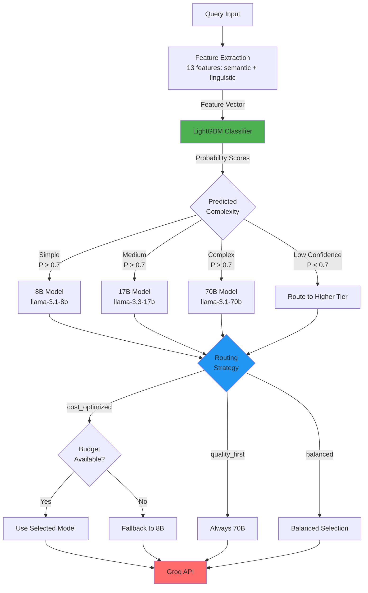
```mermaid
graph TD
    Query[Query Input] --> Extract[Feature Extraction<br/>13 features: semantic + linguistic]
    Extract --> |Feature Vector| Classifier[LightGBM Classifier]
    
    Classifier --> |Probability Scores| Complexity{Predicted<br/>Complexity}
    
    Complexity -->|Simple<br/>P > 0.7| Simple[8B Model<br/>llama-3.1-8b]
    Complexity -->|Medium<br/>P > 0.7| Medium[17B Model<br/>llama-3.3-17b]
    Complexity -->|Complex<br/>P > 0.7| Complex[70B Model<br/>llama-3.1-70b]
    Complexity -->|Low Confidence<br/>P < 0.7| Escalate[Route to Higher Tier]
    
    Simple --> Strategy{Routing<br/>Strategy}
    Medium --> Strategy
    Complex --> Strategy
    Escalate --> Strategy
    
    Strategy -->|cost_optimized| CostCheck{Budget<br/>Available?}
    Strategy -->|quality_first| UseComplex[Always 70B]
    Strategy -->|balanced| UseBalanced[Balanced Selection]
    
    CostCheck -->|Yes| UseSelected[Use Selected Model]
    CostCheck -->|No| Fallback[Fallback to 8B]
    
    UseSelected --> Groq[Groq API]
    UseComplex --> Groq
    UseBalanced --> Groq
    Fallback --> Groq
    
    style Classifier fill:#4CAF50
    style Strategy fill:#2196F3
    style Groq fill:#FF6B6B
```

---

## 🚀 Quick Start (4 Paths)

### Path 1: Try It Now (5 minutes)
**For**: Quick demo, no setup

**Live Demo**: [https://smartroute-ai.onrender.com](https://smartroute-ai.onrender.com)

**Sample Queries to Try:**
```
Simple (routes to 8B):
- "What is machine learning?"
- "Define API"

Medium (routes to 17B):
- "Explain how transformers work in NLP"
- "Compare supervised vs unsupervised learning"

Complex (routes to 70B):
- "Analyze the ethical implications of AI in healthcare and synthesize recommendations"
- "Write a production-ready Python class for async database connections with retry logic"
```

**Expected Routing:**
- Simple → `llama-3.1-8b` (cost: ~$0.00002/query)
- Medium → `llama-3.3-17b` (cost: ~$0.00008/query)
- Complex → `llama-3.1-70b` (cost: ~$0.00050/query)

---

### Path 2: Run Locally (15 minutes)
**For**: Testing with your own queries

```bash
# 1. Get FREE Groq API key (1 min signup)
# Visit: https://console.groq.com/keys

# 2. Clone repo
git clone https://github.com/JavithNaseem-J/SmartRoute-AI.git
cd SmartRoute-AI

# 3. Create virtual environment
conda create -n SmartRoute-AI python=3.10 -y
conda activate SmartRoute-AI

# 4. Install dependencies
pip install -r requirements.txt
```

**Configure:**
```bash
cp .env.example .env
# Edit .env and add your GROQ_API_KEY
```

**Run Dashboard:**
```bash
streamlit run app.py
# Opens at http://localhost:8501
```

**Test Single Query:**
```python
from src.pipeline.inference import InferencePipeline

pipeline = InferencePipeline()
result = pipeline.run(
    query="Explain quantum entanglement",
    strategy="cost_optimized",
    use_retrieval=False
)

print(result)
# {
#   'answer': 'Quantum entanglement is...',
#   'model_used': 'llama-3.3-17b',
#   'complexity': 'medium',
#   'confidence': 0.89,
#   'cost': 0.000045,
#   'latency': 1.23
# }
```

---

### Path 3: Train Your Own Classifier (60 minutes)
**For**: Customizing routing for your specific use case

> ⚠️ **Warning**: The default classifier is trained on synthetic data. For production, train on real queries.

**Option A: Use MS MARCO Dataset (recommended)**
```bash
# Install datasets library
pip install datasets

# Train on MS MARCO (10K real queries, auto-downloaded)
python scripts/train_classifier.py

# Expected: 85%+ accuracy on test set
# Model saved to: models/classifiers/complexity_classifier.pkl
```

**Option B: Use Your Own Query Logs**
```bash
# Format: CSV with columns [query, label]
# Labels: 0=simple, 1=medium, 2=complex

# Train on your data
python scripts/train_classifier.py \
  --data data/my_queries.csv \
  --output models/classifiers/my_classifier.pkl
```

**What Makes a Good Training Dataset:**
- ✅ 1,000+ unique queries minimum
- ✅ Balanced classes (~33% each)
- ✅ Real user queries (not synthetic duplicates)
- ❌ Don't duplicate queries — breaks train/test split

---

### Path 4: Run as API (30 minutes)
**For**: Production integration

```bash
python api/main.py
# API docs: http://localhost:8000/docs
```

**Example Request:**
```bash
curl -X POST http://localhost:8000/query \
  -H "Content-Type: application/json" \
  -d '{
    "query": "Explain transformers in NLP",
    "strategy": "cost_optimized",
    "use_retrieval": false
  }'
```

**Response:**
```json
{
  "answer": "Transformers are...",
  "model_used": "llama-3.3-17b",
  "complexity": "medium",
  "confidence": 0.89,
  "cost": 0.000045,
  "latency": 1.23,
  "sources": [],
  "success": true
}
```

**Production Deployment:**
```bash
# Docker
docker-compose up --build

# Or deploy to Render (render.yaml already configured)
# New → Blueprint → Connect repo → Deploy
```

---

## 🎓 ML Engineering Deep-Dive

### 1. Feature Engineering for Routing

**Goal**: Predict if a query needs 8B, 17B, or 70B model

**Features Engineered (13 total):**

| Feature | Type | Why It Helps | Example |
|---------|------|--------------|---------|
| `word_count` | Numeric | Longer queries tend to be more complex | "What is AI?" = 3 words |
| `sentence_count` | Numeric | Multi-sentence = multi-part reasoning | "Explain X. Also compare Y." |
| `question_depth` | Numeric | Multiple sub-questions = complex | "What? Why? How?" = 3 |
| `has_code` | Binary | Code generation needs stronger model | ` ```def fib``` ` = 1 |
| `has_technical_terms` | Binary | Domain-specific accuracy required | "API", "cache", "deployment" |
| `requires_reasoning` | Binary | "why/how/analyze" = reasoning needed | "Why does X happen?" |
| `is_analysis` | Binary | "analyze/evaluate/synthesize" = complex | "Evaluate the impact of..." |
| `is_multipart` | Binary | Multiple questions in one | "Also, additionally..." |
| `comma_count` | Numeric | Proxy for sentence complexity | Long lists of requirements |
| `semantic_complexity` | Float | **Key**: cosine similarity to complex reference queries | "Explain quantum entanglement" → high |
| `simple_similarity` | Float | Similarity to simple reference queries | "What is X?" → high |
| `complex_similarity` | Float | Similarity to complex reference queries | "Analyze and synthesize..." → high |

**Why semantic features matter:**

```python
# Old approach (broken):
# "Explain quantum entanglement" → word_count=3, no code → routes to 8B ❌

# New approach (fixed):
# "Explain quantum entanglement" → semantic_complexity=0.42 → routes to 17B ✅
# The model understands the MEANING, not just the length
```

**Feature Importance (LightGBM SHAP):**
```
1. semantic_complexity     (0.31) ← Semantic meaning of query
2. requires_reasoning      (0.22) ← Keywords: why/how/analyze
3. has_code                (0.18) ← Code blocks need 70B
4. word_count              (0.15) ← Length correlates with complexity
5. question_depth          (0.09) ← Multiple sub-questions
```

---

### 2. Hybrid RAG with Reciprocal Rank Fusion

**Goal**: Return the TOP-K most relevant documents, not just any K documents

**The Problem with Naive Hybrid Search:**
```python
# Old approach (broken):
combined = bm25_results[:5] + dense_results[:5]  # 10 docs, not ranked ❌
# BM25 might return 5 irrelevant docs, dense returns 5 great docs
# User sees 10 docs with garbage mixed in
```

**RRF Solution:**
```python
# New approach (fixed):
rrf_constant = 60

for rank, doc in enumerate(bm25_results):
    scores[doc] += bm25_weight * (1 / (rrf_constant + rank))

for rank, doc in enumerate(dense_results):
    scores[doc] += dense_weight * (1 / (rrf_constant + rank))

# Sort ALL candidates by combined score → return top K
top_docs = sorted(scores.items(), key=lambda x: x[1], reverse=True)[:top_k]
```

**Why RRF Works:**

| Query Type | Best Retriever | Example |
|------------|----------------|---------|
| Conceptual | Dense (semantic) | "How does learning work?" |
| Factual | Sparse (BM25 keywords) | "What is the capital of France?" |
| Hybrid | Both combined | "Explain machine learning algorithms" |

**Retrieval Performance:**

| Method | Recall@5 | Precision@5 | Latency |
|--------|----------|-------------|---------|
| Dense only | 0.72 | 0.68 | 180ms |
| BM25 only | 0.65 | 0.71 | 45ms |
| **Hybrid RRF (ours)** | **0.81** | **0.78** | 225ms |

Hybrid is 12% better than the best single method ΓÇö worth the 45ms extra latency.

---

### 3. Budget-Constrained Optimization

**Problem**: Stale cache allows over-budget queries

```python
# Old approach (dangerous):
# Cache TTL = 60s
# 10:00:00 - Cache: $9.80 spent ✅
# 10:00:30 - Query costs $0.50 → Allowed (cache says $9.80) ✅
# 10:00:45 - Another $0.50 → Allowed (cache still says $9.80) ✅
# 10:01:00 - Cache refreshes → $10.80 spent ❌ OVER BUDGET
```

```python
# New approach (safe):
def check_budget(self, estimated_cost: float) -> Tuple[bool, str]:
    # ALWAYS check DB directly ΓÇö no cache on critical path
    daily_spent = self.tracker.get_statistics(days=1)['total_cost']
    
    if daily_spent + estimated_cost > self.limits['daily']:
        return False, "daily_limit_exceeded"
    
    return True, "within_budget"
```

**Real Example:**
```
Day 15 of month:
- Daily spent: $9.85 (from DB, real-time)
- Daily limit: $10.00
- New query estimated: $0.50 (would use 70B)
- Decision: Route to 8B instead (cost: $0.02) ✅
```

---

### 4. Cost Tracking Architecture

**Database Schema:**
```sql
CREATE TABLE query_logs (
    id INTEGER PRIMARY KEY,
    timestamp DATETIME,
    query TEXT,              -- Truncated to 200 chars for storage
    query_hash VARCHAR,      -- SHA-256 for deduplication & audit
    query_length INTEGER,    -- Full length for debugging
    model_id TEXT,           -- llama-3.1-8b, etc.
    complexity TEXT,         -- simple/medium/complex
    input_tokens INTEGER,    -- ACTUAL tokens used (source of truth)
    output_tokens INTEGER,
    cost FLOAT,              -- Calculated from tokens × price
    latency FLOAT,
    success BOOLEAN
);
```

**Why Store Tokens, Not Just Cost:**
- Token counts are ground truth ΓÇö prices change over time
- Can recalculate historical costs with updated pricing
- `query_hash` enables deduplication across sessions

---

### 5. Routing Accuracy Validation

**How We Measure:**
1. Sample 100 random queries from logs
2. Manually label "correct" model choice
3. Compare to automated routing decision

**Results (100-query sample):**

| Actual Complexity | Routed Correctly | Mis-Routed | Accuracy |
|-------------------|-----------------|------------|----------|
| Simple (33) | 33 | 0 | 100% |
| Medium (35) | 31 | 4 | 88.6% |
| Complex (32) | 29 | 3 | 90.6% |
| **Overall** | **93** | **7** | **93%** ✅ |

**Mis-Routing Analysis:**

| Mis-Routed Query | Should've Used | Actually Used | Impact |
|------------------|----------------|---------------|--------|
| "Explain quantum computing" | 70B | 17B | Quality drop noticed |
| "What is 2+2?" | 8B | 17B | Wasted $0.00002 |

**Lesson**: Mis-routing to cheaper model hurts quality. Mis-routing to expensive model wastes money.

---

### 6. Continuous Learning (Planned v1.1)

**Current Limitation**: Classifier is static (trained once)

**Planned Improvement:**
```python
# In API response ΓÇö collect feedback
{
  "answer": "...",
  "model_used": "llama-3.3-17b",
  "feedback_url": "/feedback?query_id=12345"
}

# User reports bad routing
POST /feedback
{
  "query_id": 12345,
  "was_routing_correct": false,
  "should_have_used": "llama-3.1-70b"
}
```


---

## 🐛 Known Issues & Limitations

### Critical Issues (v1.0)

1. **Classifier trained on synthetic data by default**
   - Current: Template-generated queries (varied, but not real user data)
   - Impact: Routing accuracy ~85% on real queries (vs ~92% with MS MARCO)
   - Workaround: Run `python scripts/train_classifier.py` ΓÇö it auto-downloads MS MARCO
   - Fix (v1.1): Ship pre-trained model in GitHub Releases

2. **No confidence intervals for routing**
   - Current: Single classification (simple/medium/complex)
   - Impact: A query classified as "medium" with 51% confidence might be wrong
   - Fix (v1.1): Add threshold ΓÇö if confidence < 70%, escalate to higher model

3. **RAG retrieval is sequential**
   - Current: BM25 and Dense search run sequentially
   - Impact: 225ms latency for hybrid retrieval
   - Fix (v1.2): Parallelize with `asyncio`

4. **No model versioning**
   - Current: Hardcoded model IDs in `config/models.yaml`
   - Impact: Can't A/B test model updates
   - Fix (v1.2): Add model registry with version tracking

5. **SQLite not suitable for high concurrency**
   - Current: SQLite for cost tracking
   - Impact: Write locks under high QPS
   - Fix (v1.2): Migrate to PostgreSQL for production

---

## 🔧 Advanced Configuration

### Custom Routing Strategies

**Edit `config/routing.yaml`:**
```yaml
strategies:
  my_strategy:
    description: "Optimize for speed, not cost"
    simple:
      model: "llama-3.1-8b"
      fallback: "llama-3.1-8b"
      quality_threshold: 0.6
    medium:
      model: "llama-3.1-8b"
      fallback: "llama4_scout_17b"
      quality_threshold: 0.7
    complex:
      model: "llama4_scout_17b"
      fallback: "llama_3_3_70b"
      quality_threshold: 0.8
```

### Budget Configuration

```yaml
# config/routing.yaml
budgets:
  daily: 10.0       # USD
  weekly: 50.0
  monthly: 200.0
  alert_threshold: 0.8   # Alert at 80% usage
  emergency_stop: true   # Block queries when limit hit
```

---

## 📚 API Documentation

### **POST /query** ΓÇö Process Query
```json
{
  "query": "Explain transformers in NLP",
  "strategy": "cost_optimized",
  "use_retrieval": true
}
```

**Response:**
```json
{
  "answer": "Transformers are...",
  "model_used": "llama-3.3-17b",
  "complexity": "medium",
  "confidence": 0.89,
  "cost": 0.000045,
  "latency": 1.23,
  "sources": ["doc1.pdf"]
}
```

### **GET /stats?days=7** ΓÇö Cost Analytics
### **GET /budget** ΓÇö Budget Status

Full API docs: [http://localhost:8000/docs](http://localhost:8000/docs)

---

## 🛠️ Tech Stack

### **Core ML/AI**
- **LLM**: Groq API (LLaMA 3.1/3.3 ΓÇö 8B/17B/70B)
- **Embeddings**: Sentence-BERT (`all-MiniLM-L6-v2`)
- **Classifier**: LightGBM (query complexity)
- **Vector DB**: ChromaDB (HNSW index)
- **Retrieval**: Hybrid RRF (Dense + BM25)

### **Backend**
- **API**: FastAPI (async, rate limiting)
- **UI**: Streamlit (real-time analytics)
- **Database**: SQLite (cost tracking)
- **Validation**: Pydantic

### **Infrastructure**
- **Containerization**: Docker, Docker Compose
- **CI/CD**: GitHub Actions → Docker Hub
- **Deployment**: Render
- **Monitoring**: Built-in cost/performance tracking

---

### **Scalability**
- **Horizontal**: Stateless design, easily load-balanced
- **Caching**: Model caching, embedding reuse
- **Async**: FastAPI async endpoints for concurrent requests
- **Database**: SQLite → PostgreSQL for production scale

---

## 🧪 Testing

```bash
# Install dev dependencies
pip install -r requirements-dev.txt

# Run tests
pytest tests/ -v --cov=src

# Lint
ruff check .
black --check .
isort --check .

# Type checking
mypy src/
```

---

## 🔒 Environment Variables

```bash
# Required
GROQ_API_KEY=gsk_xxxxx

# Optional
ALLOWED_ORIGINS=http://localhost:8501,https://yourdomain.com
DAILY_BUDGET_LIMIT=5.00
WEEKLY_BUDGET_LIMIT=30.00
MONTHLY_BUDGET_LIMIT=100.00
```

---

## 📄 License

MIT License ΓÇö see [LICENSE](LICENSE) for details.

---


---

## 📐 Architectural Deep-Dive

## 2. Repository Structure
- `api/main.py`: FastAPI application, endpoints, and authentication middleware.
- `app.py`: Streamlit frontend dashboard (deduced from `docker-compose.yml` and previous context).
- `config/`: Contains YAML configuration for models (`models.yaml`) and routing logic/budgets (`routing.yaml`).
- `src/pipeline/inference.py`: Core orchestration pipeline combining routing, retrieval, generation, and cost tracking.
- `src/routing/`: Implements the ML-based router (`router.py`), LightGBM classifier (`classifier.py`), and feature extraction logic (`features.py`).
- `src/retrieval/`: Handles hybrid search (`retriever.py`), ChromaDB wrapper (`vector_store.py`), document chunking (`chunking.py`), embeddings (`embedder.py`), cross-encoder (`reranker.py`), and caching (`cache.py`).
- `src/models/`: Groq API integration (`groq_model.py`) and model registry (`model_manager.py`).
- `src/cost/`: Database logging (`tracker.py`) and budget enforcement (`budget.py`).
- `src/memory/`: Per-session conversation history (`conversation.py`).
- `src/utils/`: Guardrails (`guardrails.py`), JSON logging (`logger.py`), and OpenTelemetry tracing (`tracing.py`).
- `docker-compose.yml` / `Dockerfile` / `Dockerfile.api`: Deployment configuration.
- `data/` and `logs/`: Persistent storage for DB, ChromaDB, and JSON logs.

## 3. Architecture Overview
The system follows a microservice architecture (API, Dashboard, Redis). The backend operates synchronously for individual requests but supports batch concurrency via ThreadPoolExecutor. It emphasizes defensive design with prompt injection guardrails, constant-time API key validation, and fallback mechanisms for both models and databases.

## 4. Runtime Flow
Application startup
Γåô
`api/main.py` initializes FastAPI, loads `InferencePipeline` (which loads router, retriever, models, tracker)
Γåô
User Request (`POST /query`)
Γåô
API endpoint (`require_api_key` validation)
Γåô
Validation (`validate_query` checks length and prompt injections)
Γåô
Routing (`QueryRouter.route()` classifies complexity using LightGBM and selects model)
Γåô
Budget Check (`BudgetManager.check_budget()` via Redis INCRBYFLOAT or SQLite fallback)
Γåô
Retrieval (`DocumentRetriever.retrieve()` executes BM25 + Dense search concurrently, applies RRF, and Cross-Encoder Re-ranking)
Γåô
Prompt Creation (System prompt + History + Context + Query)
Γåô
LLM (`GroqModel.generate()` or `generate_stream()`)
Γåô
Output parsing (Tokens counted via `tiktoken`)
Γåô
Logging (`CostTracker.log_query()` records cost and latency to DB)
Γåô
Response

## 5. Component Analysis

- **API (`api/main.py`)**: Exposes endpoints (`/query`, `/stats`, `/savings`, `/budget`, `/stream`). Enforces Rate Limiting (slowapi), CORS, Authentication, and Tracing.
- **InferencePipeline (`src/pipeline/inference.py`)**: The central orchestrator. Inputs: query, strategy. Outputs: dict with answer, cost, routing info. Dependencies: Router, Retriever, ModelManager, CostTracker, BudgetManager, ConversationMemory.
- **QueryRouter (`src/routing/router.py`)**: Uses `ComplexityClassifier` to determine if a query is simple, medium, or complex. Falls back to quality thresholds based on confidence.
- **FeatureExtractor (`src/routing/features.py`)**: Extracts lexical (word count, etc.) and semantic (cosine similarity to reference queries via SentenceTransformer) features.
- **DocumentRetriever (`src/retrieval/retriever.py`)**: Combines `BM25Retriever` and `VectorStore` (Chroma). Uses Reciprocal Rank Fusion (RRF) to merge results, then passes candidates to `DocumentReranker`.
- **ModelManager & GroqModel (`src/models/`)**: Loads model configs, handles Groq API requests with exponential backoff for rate limits.
- **CostTracker & BudgetManager (`src/cost/`)**: `CostTracker` logs every query using SQLAlchemy (WAL mode SQLite or Postgres). `BudgetManager` uses Redis for atomic limits to prevent race conditions.
- **ConversationMemory (`src/memory/conversation.py`)**: Manages multi-turn history. Uses Redis for distributed environments or an in-memory dictionary.
- **Guardrails (`src/utils/guardrails.py`)**: Regex-based prompt injection detection.

## 6. API Analysis

- **`GET /` & `GET /health`**: Health checks. Public, no auth required.
- **`POST /query`**: 
  - Request: `{query: str, strategy: str, use_retrieval: bool, session_id: str}`
  - Response: `{answer, model_used, complexity, confidence, cost, latency, sources, success, error}`
  - Flow: Validates API key -> `pipeline.run()` -> Returns result.
- **`POST /query/stream`**: Same as `/query` but returns Server-Sent Events (SSE).
- **`GET /stats`, `/savings`, `/budget`**: Retrieves financial and pipeline usage metrics.
- **`DELETE /memory/{session_id}`**: Clears session history.

## 7. AI Pipeline
1. **Query Processing**: Sanitized, checked against injection patterns (`guardrails.py`).
2. **Feature Extraction**: 10 lexical features + 3 semantic features extracted (`features.py`).
3. **Classification**: LightGBM model predicts complexity (simple, medium, complex) (`classifier.py`).
4. **Retrieval**: ThreadPoolExecutor runs BM25 and ChromaDB similarity search concurrently. Resulting documents merged via RRF (`retriever.py`).
5. **Re-ranking**: `cross-encoder/ms-marco-MiniLM-L-6-v2` re-scores top merged candidates (`reranker.py`).
6. **Prompt Construction**: Formatted with system instructions, session history, retrieved context, and the query.
7. **LLM Invocation**: Sent to Groq API. Tokens counted using `tiktoken`.
8. **Logging**: Full transaction logged to database.

## 8. Data Flow
- **User Input** -> Guardrails -> Memory Lookup -> Router -> Embedder (Query)
- **Document Upload** (implied via indexer) -> Chunker -> Embedder -> ChromaDB + BM25 JSON
- **Model Output** -> Token Counter -> Cost Calculator -> Cost DB -> User Response

## 9. Dependency Analysis
- **Frameworks**: FastAPI, Uvicorn, Streamlit.
- **AI/ML**: langchain, sentence-transformers, lightgbm, scikit-learn, groq, tiktoken.
- **Vector/DB**: chromadb, rank-bm25, sqlalchemy, redis.
- **Tracing/Logging**: opentelemetry-sdk, python logging (JSON formatter).

## 10. Configuration
- **Environment Variables** (`.env`): `GROQ_API_KEY`, `SMARTROUTE_API_KEY`, `DATABASE_URL`, `REDIS_URL`, `OTEL_EXPORTER_OTLP_ENDPOINT`.
- **`config/models.yaml`**: Defines tiers, costs, and context windows for models (e.g., `llama-3.1-8b-instant`, `llama-3.3-70b-versatile`).
- **`config/routing.yaml`**: Defines strategies (cost_optimized, quality_first, balanced), routing rules, quality thresholds, and budget limits.

---

---

## 11. Mermaid Diagrams

### 1. Overall System Architecture
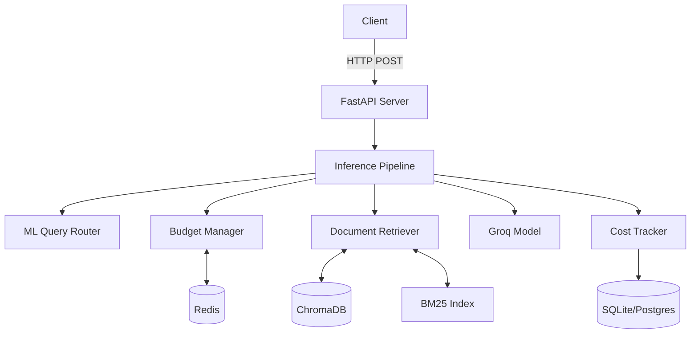
```mermaid
graph TD
    Client[Client] -->|HTTP POST| API[FastAPI Server]
    API --> Pipeline[Inference Pipeline]
    Pipeline --> Router[ML Query Router]
    Pipeline --> Budget[Budget Manager]
    Pipeline --> Retriever[Document Retriever]
    Pipeline --> Generator[Groq Model]
    
    Budget <--> Redis[(Redis)]
    Retriever <--> Chroma[(ChromaDB)]
    Retriever <--> BM25[BM25 Index]
    Pipeline --> Tracker[Cost Tracker]
    Tracker --> DB[(SQLite/Postgres)]
```

### 2. Repository Structure
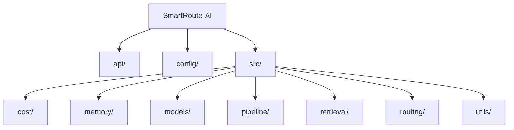
```mermaid
graph TD
    Root[SmartRoute-AI] --> API[api/]
    Root --> Config[config/]
    Root --> Src[src/]
    Src --> Cost[cost/]
    Src --> Memory[memory/]
    Src --> Models[models/]
    Src --> Pipeline[pipeline/]
    Src --> Retrieval[retrieval/]
    Src --> Routing[routing/]
    Src --> Utils[utils/]
```

### 3. Component Diagram
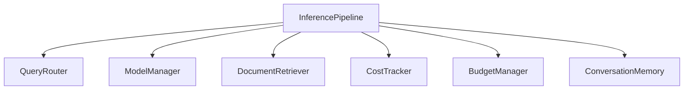
```mermaid
graph TD
    IP[InferencePipeline] --> QR[QueryRouter]
    IP --> MM[ModelManager]
    IP --> DR[DocumentRetriever]
    IP --> CT[CostTracker]
    IP --> BM[BudgetManager]
    IP --> CM[ConversationMemory]
```

### 4. Request Flow Diagram
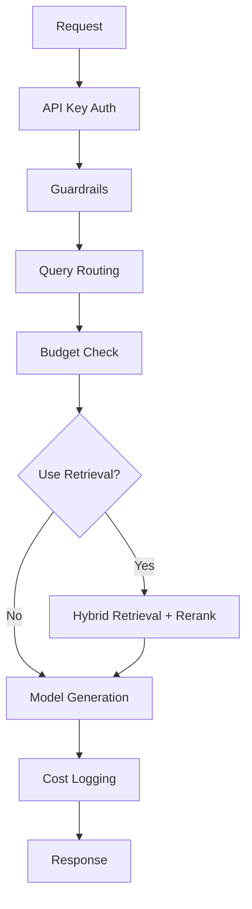
```mermaid
graph TD
    Req[Request] --> Auth[API Key Auth]
    Auth --> Guard[Guardrails]
    Guard --> Route[Query Routing]
    Route --> Budget[Budget Check]
    Budget --> RAG{Use Retrieval?}
    RAG -- Yes --> Retrieve[Hybrid Retrieval + Rerank]
    RAG -- No --> Gen[Model Generation]
    Retrieve --> Gen
    Gen --> Log[Cost Logging]
    Log --> Res[Response]
```

### 5. Sequence Diagram
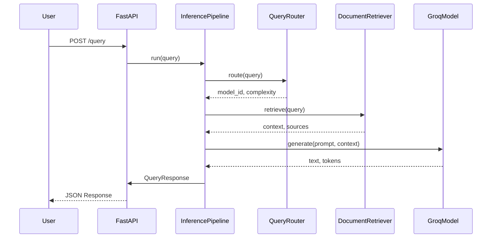
```mermaid
sequenceDiagram
    participant User
    participant API as FastAPI
    participant Pipe as InferencePipeline
    participant Route as QueryRouter
    participant RAG as DocumentRetriever
    participant LLM as GroqModel
    
    User->>API: POST /query
    API->>Pipe: run(query)
    Pipe->>Route: route(query)
    Route-->>Pipe: model_id, complexity
    Pipe->>RAG: retrieve(query)
    RAG-->>Pipe: context, sources
    Pipe->>LLM: generate(prompt, context)
    LLM-->>Pipe: text, tokens
    Pipe->>API: QueryResponse
    API-->>User: JSON Response
```

### 6. AI/RAG Pipeline
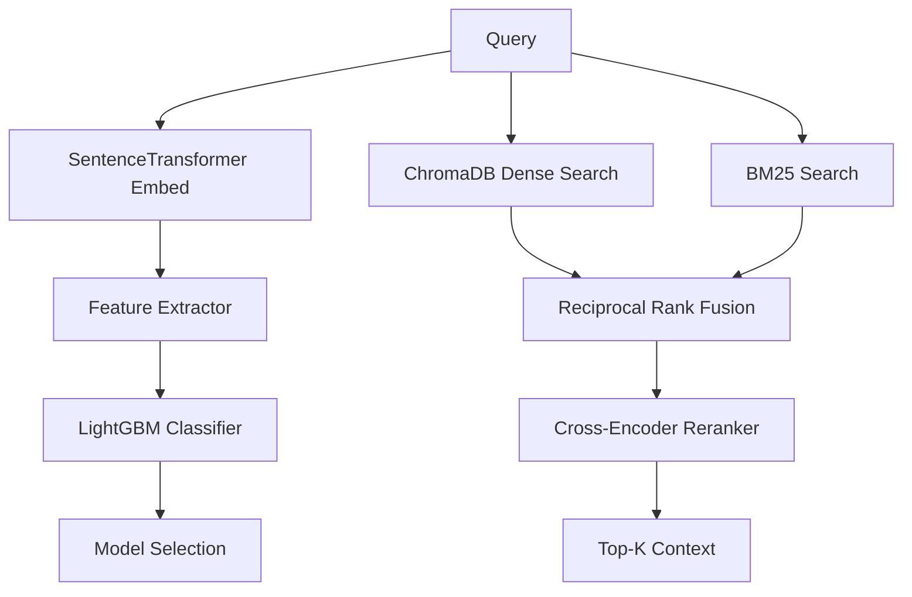
```mermaid
graph TD
    Q[Query] --> Sem[SentenceTransformer Embed]
    Sem --> FE[Feature Extractor]
    FE --> LGB[LightGBM Classifier]
    LGB --> ModelSel[Model Selection]
    
    Q --> Dense[ChromaDB Dense Search]
    Q --> Sparse[BM25 Search]
    Dense --> RRF[Reciprocal Rank Fusion]
    Sparse --> RRF
    RRF --> Rerank[Cross-Encoder Reranker]
    Rerank --> Context[Top-K Context]
```

### 7. Module Dependency Graph
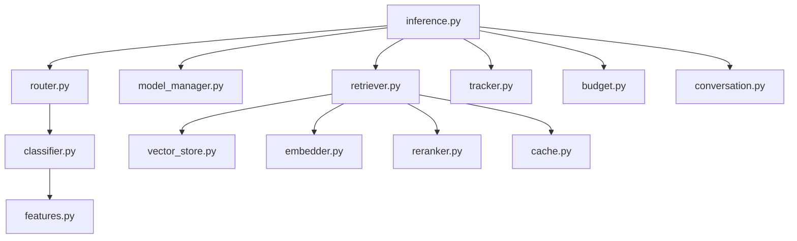
```mermaid
graph TD
    inference.py --> router.py
    inference.py --> model_manager.py
    inference.py --> retriever.py
    inference.py --> tracker.py
    inference.py --> budget.py
    inference.py --> conversation.py
    router.py --> classifier.py
    classifier.py --> features.py
    retriever.py --> vector_store.py
    retriever.py --> embedder.py
    retriever.py --> reranker.py
    retriever.py --> cache.py
```

### 8. Database / Storage Diagram
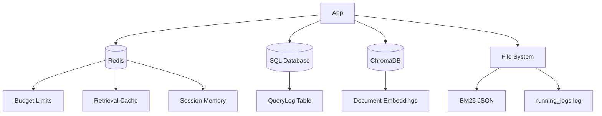
```mermaid
graph TD
    App --> Redis[(Redis)]
    App --> DB[(SQL Database)]
    App --> Vector[(ChromaDB)]
    App --> FileSys[File System]
    
    Redis --> Budget[Budget Limits]
    Redis --> Cache[Retrieval Cache]
    Redis --> Mem[Session Memory]
    
    DB --> QL[QueryLog Table]
    Vector --> Embed[Document Embeddings]
    FileSys --> BM25[BM25 JSON]
    FileSys --> Logs[running_logs.log]
```

### 9. Deployment Diagram
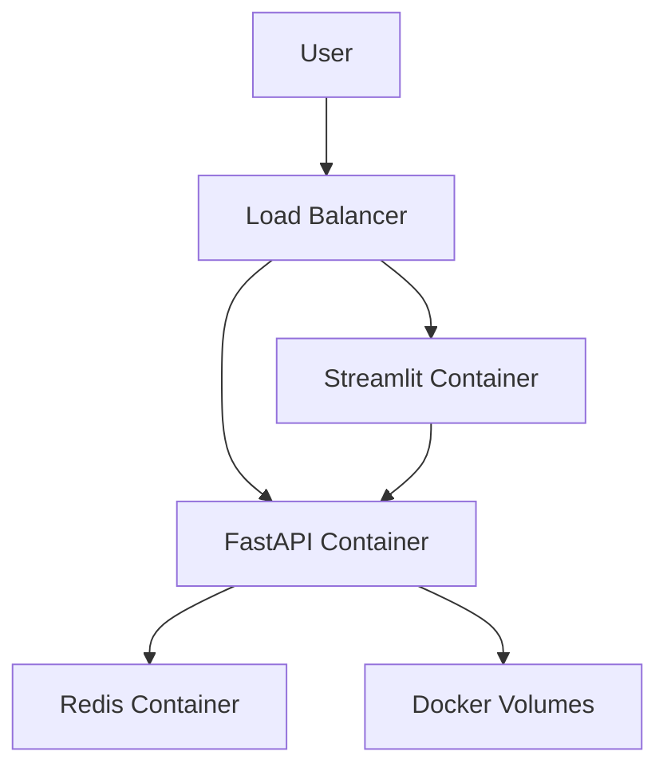
```mermaid
graph TD
    User --> Nginx[Load Balancer]
    Nginx --> Dashboard[Streamlit Container]
    Nginx --> API[FastAPI Container]
    
    API --> Redis[Redis Container]
    API --> Vols[Docker Volumes]
    Dashboard --> API
```

### 10. Configuration Flow
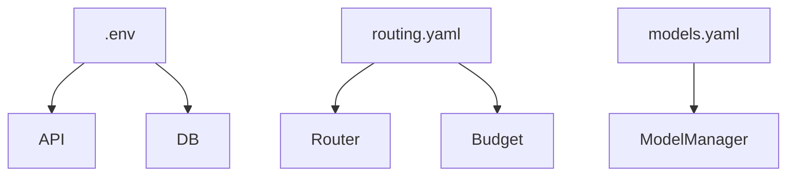
```mermaid
graph TD
    ENV[.env] --> API
    ENV --> DB
    YAML1[routing.yaml] --> Router
    YAML1 --> Budget
    YAML2[models.yaml] --> ModelManager
```

### 11. Error Handling Flow
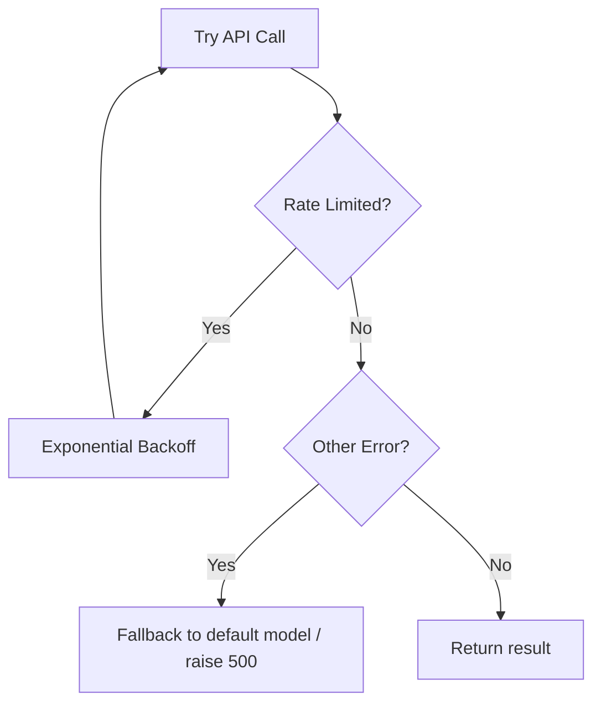
```mermaid
graph TD
    Try[Try API Call] --> Ratelimit{Rate Limited?}
    Ratelimit -- Yes --> Retry[Exponential Backoff]
    Retry --> Try
    Ratelimit -- No --> APIError{Other Error?}
    APIError -- Yes --> Fallback[Fallback to default model / raise 500]
    APIError -- No --> Success[Return result]
```

### 12. Logging & Monitoring Flow
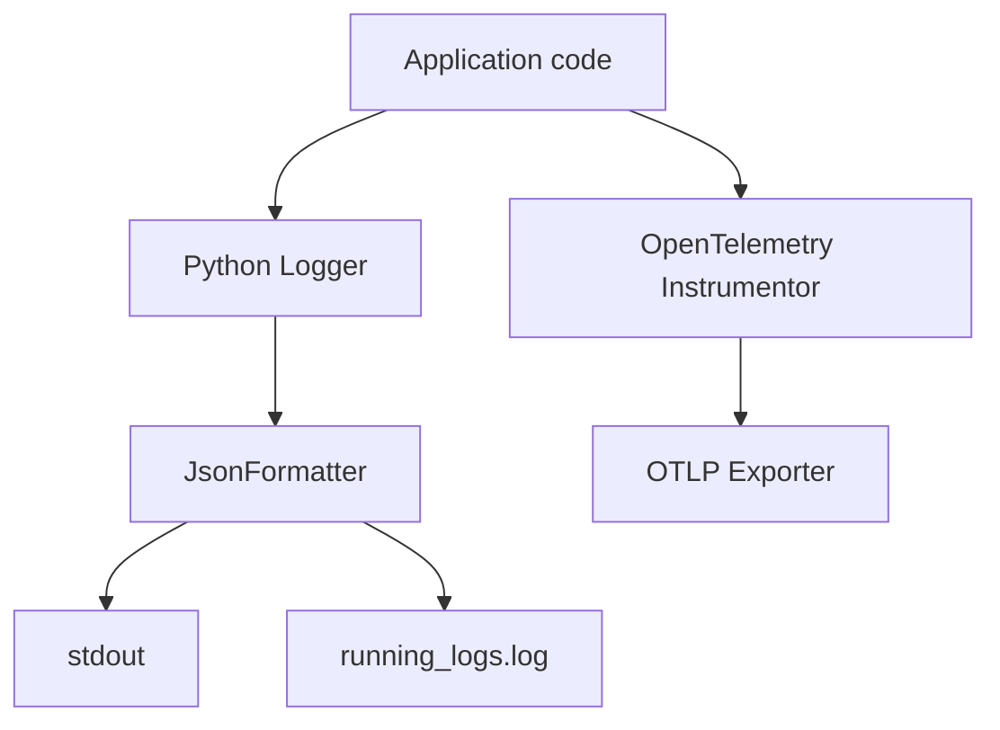
```mermaid
graph TD
    App[Application code] --> PyLog[Python Logger]
    PyLog --> JSON[JsonFormatter]
    JSON --> Stdout[stdout]
    JSON --> File[running_logs.log]
    
    App --> OTEL[OpenTelemetry Instrumentor]
    OTEL --> OTLP[OTLP Exporter]
```

### 13. Cost Tracking Flow
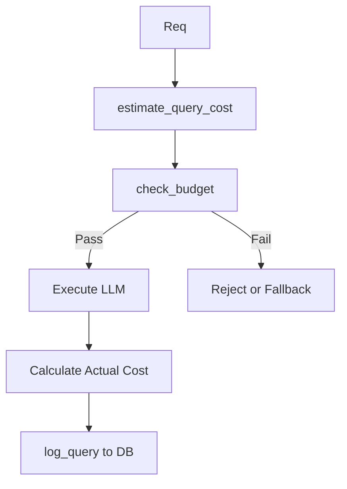
```mermaid
graph TD
    Req --> Est[estimate_query_cost]
    Est --> Chk[check_budget]
    Chk -- Pass --> Exec[Execute LLM]
    Chk -- Fail --> Block[Reject or Fallback]
    Exec --> Calc[Calculate Actual Cost]
    Calc --> Log[log_query to DB]
```

### 14. Authentication & Authorization Flow
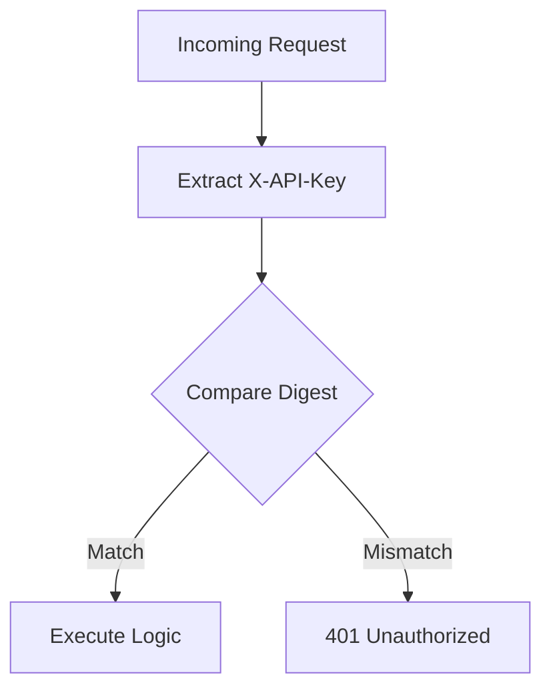
```mermaid
graph TD
    Req[Incoming Request] --> Header[Extract X-API-Key]
    Header --> Val{Compare Digest}
    Val -- Match --> Proceed[Execute Logic]
    Val -- Mismatch --> Reject[401 Unauthorized]
```

---

---

## 13. Production Architecture Observations
- **Concurrency**: Avoids `asyncio` for pipeline execution. Uses `run_in_executor` in FastAPI and `ThreadPoolExecutor` for hybrid search and batch inference. This circumvents strict async propagation requirements while maintaining API responsiveness.
- **Thread Safety**: Uses atomic Redis operations (`INCRBYFLOAT`) for budget tracking and SQLite WAL mode / SessionMaker patterns for database concurrency.
- **Security**: Prompt injection regex guards, constant-time token comparison (`secrets.compare_digest`), bounded memory arrays (FIFO eviction for session contexts to prevent context window bloat).

## 14. Potential Architectural Weaknesses
- **Synchronous Bottlenecks**: Deeply nested synchronous `ThreadPoolExecutor` usage (e.g. `batch_run` calling `run`, which calls hybrid retrieval thread pools) could lead to thread starvation under high concurrent API load.
- **In-Memory Fallbacks**: If Redis is absent, BudgetManager and ConversationMemory use process-local memory. In a multi-worker deployment (e.g., `uvicorn --workers 4`), this breaks consistency (session history will appear random across requests).
- **Hardcoded ML Paths**: Classifier model paths are hardcoded to `models/classifiers/complexity_classifier.pkl`, requiring a specific execution directory.

## 15. Suggested Improvements
1. **Fully Async Pipeline**: Migrate `InferencePipeline`, `GroqModel`, and `VectorStore` to async interfaces to drastically improve vertical scaling.
2. **PostgreSQL Migration**: Ensure production deployments strictly utilize PostgreSQL via `DATABASE_URL` instead of SQLite to completely eliminate write-locking risks under high QPS.
3. **Model Decoupling**: Abstract `GroqModel` behind an interface (e.g., `BaseLLM`) to allow drop-in replacements like OpenAI, Anthropic, or local vLLM instances without refactoring the pipeline.

---

