## 📐 Architectural Deep-Dive

## 2. Repository Structure
- `api/main.py`: FastAPI application, endpoints, and authentication middleware.
- `app.py`: Streamlit frontend dashboard (deduced from `docker-compose.yml` and previous context).
- `config/`: Contains YAML configuration for models (`models.yaml`) and routing logic/budgets (`routing.yaml`).
- `src/pipeline/inference.py`: Core orchestration pipeline combining routing, retrieval, generation, and cost tracking.
- `src/routing/`: Implements the ML-based router (`router.py`), LightGBM classifier (`classifier.py`), and feature extraction logic (`features.py`).
- `src/retrieval/`: Handles hybrid search (`retriever.py`), ChromaDB wrapper (`vector_store.py`), document chunking (`chunking.py`), embeddings (`embedder.py`), cross-encoder (`reranker.py`), and caching (`cache.py`).
- `src/models/`: Groq API integration (`groq_model.py`) and model registry (`model_manager.py`).
- `src/cost/`: Database logging (`tracker.py`) and budget enforcement (`budget.py`).
- `src/memory/`: Per-session conversation history (`conversation.py`).
- `src/utils/`: Guardrails (`guardrails.py`), JSON logging (`logger.py`), and OpenTelemetry tracing (`tracing.py`).
- `docker-compose.yml` / `Dockerfile` / `Dockerfile.api`: Deployment configuration.
- `data/` and `logs/`: Persistent storage for DB, ChromaDB, and JSON logs.

## 3. Architecture Overview
The system follows a microservice architecture (API, Dashboard, Redis). The backend operates synchronously for individual requests but supports batch concurrency via ThreadPoolExecutor. It emphasizes defensive design with prompt injection guardrails, constant-time API key validation, and fallback mechanisms for both models and databases.

## 4. Runtime Flow
Application startup
Γåô
`api/main.py` initializes FastAPI, loads `InferencePipeline` (which loads router, retriever, models, tracker)
Γåô
User Request (`POST /query`)
Γåô
API endpoint (`require_api_key` validation)
Γåô
Validation (`validate_query` checks length and prompt injections)
Γåô
Routing (`QueryRouter.route()` classifies complexity using LightGBM and selects model)
Γåô
Budget Check (`BudgetManager.check_budget()` via Redis INCRBYFLOAT or SQLite fallback)
Γåô
Retrieval (`DocumentRetriever.retrieve()` executes BM25 + Dense search concurrently, applies RRF, and Cross-Encoder Re-ranking)
Γåô
Prompt Creation (System prompt + History + Context + Query)
Γåô
LLM (`GroqModel.generate()` or `generate_stream()`)
Γåô
Output parsing (Tokens counted via `tiktoken`)
Γåô
Logging (`CostTracker.log_query()` records cost and latency to DB)
Γåô
Response

## 5. Component Analysis

- **API (`api/main.py`)**: Exposes endpoints (`/query`, `/stats`, `/savings`, `/budget`, `/stream`). Enforces Rate Limiting (slowapi), CORS, Authentication, and Tracing.
- **InferencePipeline (`src/pipeline/inference.py`)**: The central orchestrator. Inputs: query, strategy. Outputs: dict with answer, cost, routing info. Dependencies: Router, Retriever, ModelManager, CostTracker, BudgetManager, ConversationMemory.
- **QueryRouter (`src/routing/router.py`)**: Uses `ComplexityClassifier` to determine if a query is simple, medium, or complex. Falls back to quality thresholds based on confidence.
- **FeatureExtractor (`src/routing/features.py`)**: Extracts lexical (word count, etc.) and semantic (cosine similarity to reference queries via SentenceTransformer) features.
- **DocumentRetriever (`src/retrieval/retriever.py`)**: Combines `BM25Retriever` and `VectorStore` (Chroma). Uses Reciprocal Rank Fusion (RRF) to merge results, then passes candidates to `DocumentReranker`.
- **ModelManager & GroqModel (`src/models/`)**: Loads model configs, handles Groq API requests with exponential backoff for rate limits.
- **CostTracker & BudgetManager (`src/cost/`)**: `CostTracker` logs every query using SQLAlchemy (WAL mode SQLite or Postgres). `BudgetManager` uses Redis for atomic limits to prevent race conditions.
- **ConversationMemory (`src/memory/conversation.py`)**: Manages multi-turn history. Uses Redis for distributed environments or an in-memory dictionary.
- **Guardrails (`src/utils/guardrails.py`)**: Regex-based prompt injection detection.

## 6. API Analysis

- **`GET /` & `GET /health`**: Health checks. Public, no auth required.
- **`POST /query`**: 
  - Request: `{query: str, strategy: str, use_retrieval: bool, session_id: str}`
  - Response: `{answer, model_used, complexity, confidence, cost, latency, sources, success, error}`
  - Flow: Validates API key -> `pipeline.run()` -> Returns result.
- **`POST /query/stream`**: Same as `/query` but returns Server-Sent Events (SSE).
- **`GET /stats`, `/savings`, `/budget`**: Retrieves financial and pipeline usage metrics.
- **`DELETE /memory/{session_id}`**: Clears session history.

## 7. AI Pipeline
1. **Query Processing**: Sanitized, checked against injection patterns (`guardrails.py`).
2. **Feature Extraction**: 10 lexical features + 3 semantic features extracted (`features.py`).
3. **Classification**: LightGBM model predicts complexity (simple, medium, complex) (`classifier.py`).
4. **Retrieval**: ThreadPoolExecutor runs BM25 and ChromaDB similarity search concurrently. Resulting documents merged via RRF (`retriever.py`).
5. **Re-ranking**: `cross-encoder/ms-marco-MiniLM-L-6-v2` re-scores top merged candidates (`reranker.py`).
6. **Prompt Construction**: Formatted with system instructions, session history, retrieved context, and the query.
7. **LLM Invocation**: Sent to Groq API. Tokens counted using `tiktoken`.
8. **Logging**: Full transaction logged to database.

## 8. Data Flow
- **User Input** -> Guardrails -> Memory Lookup -> Router -> Embedder (Query)
- **Document Upload** (implied via indexer) -> Chunker -> Embedder -> ChromaDB + BM25 JSON
- **Model Output** -> Token Counter -> Cost Calculator -> Cost DB -> User Response

## 9. Dependency Analysis
- **Frameworks**: FastAPI, Uvicorn, Streamlit.
- **AI/ML**: langchain, sentence-transformers, lightgbm, scikit-learn, groq, tiktoken.
- **Vector/DB**: chromadb, rank-bm25, sqlalchemy, redis.
- **Tracing/Logging**: opentelemetry-sdk, python logging (JSON formatter).

## 10. Configuration
- **Environment Variables** (`.env`): `GROQ_API_KEY`, `SMARTROUTE_API_KEY`, `DATABASE_URL`, `REDIS_URL`, `OTEL_EXPORTER_OTLP_ENDPOINT`.
- **`config/models.yaml`**: Defines tiers, costs, and context windows for models (e.g., `llama-3.1-8b-instant`, `llama-3.3-70b-versatile`).
- **`config/routing.yaml`**: Defines strategies (cost_optimized, quality_first, balanced), routing rules, quality thresholds, and budget limits.

---

---

## 11. Mermaid Diagrams

### 1. Overall System Architecture
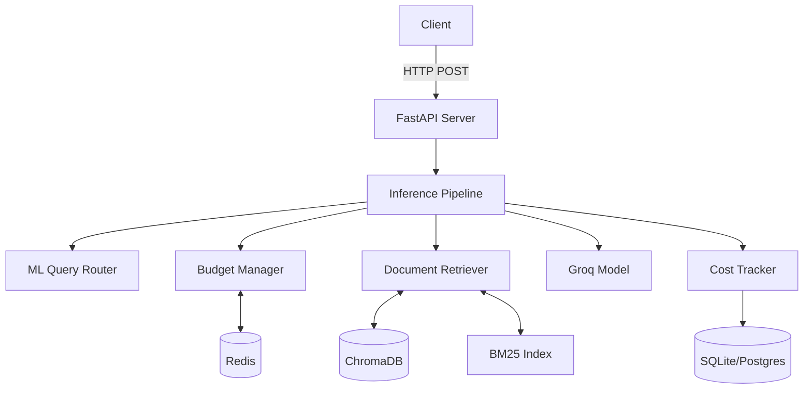
```mermaid
graph TD
    Client[Client] -->|HTTP POST| API[FastAPI Server]
    API --> Pipeline[Inference Pipeline]
    Pipeline --> Router[ML Query Router]
    Pipeline --> Budget[Budget Manager]
    Pipeline --> Retriever[Document Retriever]
    Pipeline --> Generator[Groq Model]
    
    Budget <--> Redis[(Redis)]
    Retriever <--> Chroma[(ChromaDB)]
    Retriever <--> BM25[BM25 Index]
    Pipeline --> Tracker[Cost Tracker]
    Tracker --> DB[(SQLite/Postgres)]
```

### 2. Repository Structure
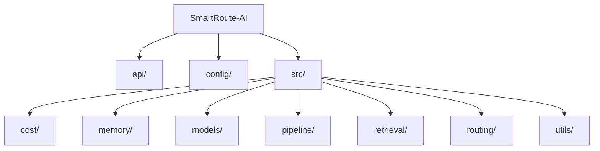
```mermaid
graph TD
    Root[SmartRoute-AI] --> API[api/]
    Root --> Config[config/]
    Root --> Src[src/]
    Src --> Cost[cost/]
    Src --> Memory[memory/]
    Src --> Models[models/]
    Src --> Pipeline[pipeline/]
    Src --> Retrieval[retrieval/]
    Src --> Routing[routing/]
    Src --> Utils[utils/]
```

### 3. Component Diagram
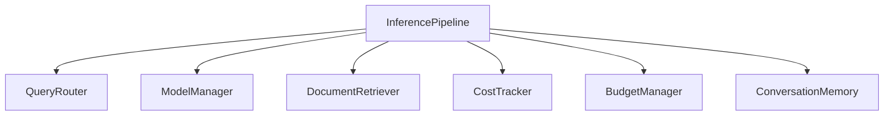
```mermaid
graph TD
    IP[InferencePipeline] --> QR[QueryRouter]
    IP --> MM[ModelManager]
    IP --> DR[DocumentRetriever]
    IP --> CT[CostTracker]
    IP --> BM[BudgetManager]
    IP --> CM[ConversationMemory]
```

### 4. Request Flow Diagram
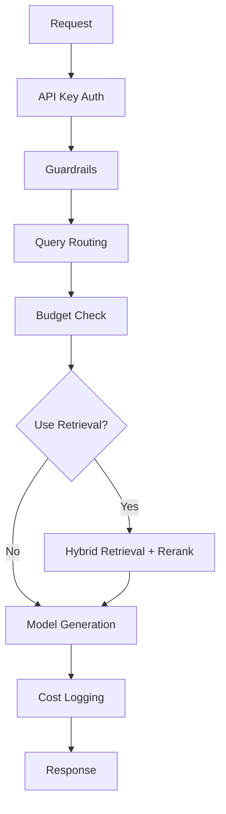
```mermaid
graph TD
    Req[Request] --> Auth[API Key Auth]
    Auth --> Guard[Guardrails]
    Guard --> Route[Query Routing]
    Route --> Budget[Budget Check]
    Budget --> RAG{Use Retrieval?}
    RAG -- Yes --> Retrieve[Hybrid Retrieval + Rerank]
    RAG -- No --> Gen[Model Generation]
    Retrieve --> Gen
    Gen --> Log[Cost Logging]
    Log --> Res[Response]
```

### 5. Sequence Diagram
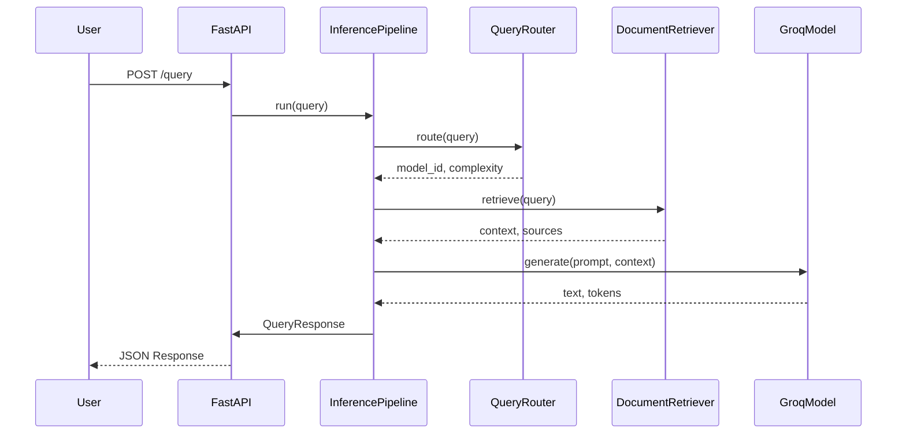
```mermaid
sequenceDiagram
    participant User
    participant API as FastAPI
    participant Pipe as InferencePipeline
    participant Route as QueryRouter
    participant RAG as DocumentRetriever
    participant LLM as GroqModel
    
    User->>API: POST /query
    API->>Pipe: run(query)
    Pipe->>Route: route(query)
    Route-->>Pipe: model_id, complexity
    Pipe->>RAG: retrieve(query)
    RAG-->>Pipe: context, sources
    Pipe->>LLM: generate(prompt, context)
    LLM-->>Pipe: text, tokens
    Pipe->>API: QueryResponse
    API-->>User: JSON Response
```

### 6. AI/RAG Pipeline
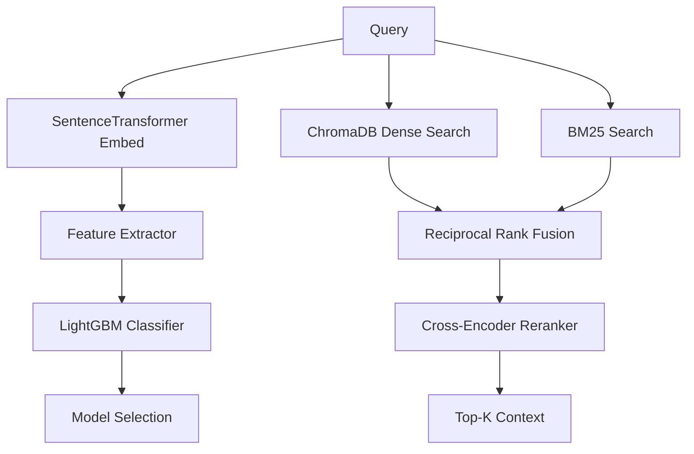
```mermaid
graph TD
    Q[Query] --> Sem[SentenceTransformer Embed]
    Sem --> FE[Feature Extractor]
    FE --> LGB[LightGBM Classifier]
    LGB --> ModelSel[Model Selection]
    
    Q --> Dense[ChromaDB Dense Search]
    Q --> Sparse[BM25 Search]
    Dense --> RRF[Reciprocal Rank Fusion]
    Sparse --> RRF
    RRF --> Rerank[Cross-Encoder Reranker]
    Rerank --> Context[Top-K Context]
```

### 7. Module Dependency Graph
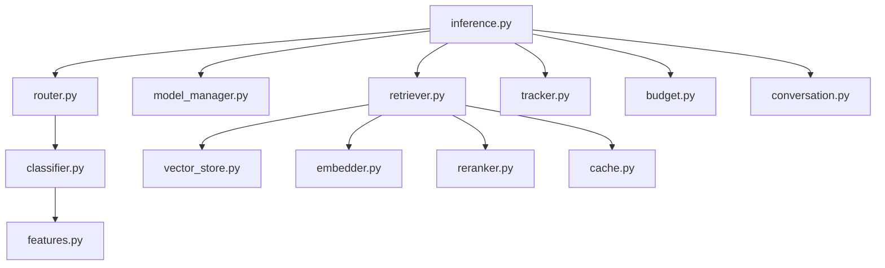
```mermaid
graph TD
    inference.py --> router.py
    inference.py --> model_manager.py
    inference.py --> retriever.py
    inference.py --> tracker.py
    inference.py --> budget.py
    inference.py --> conversation.py
    router.py --> classifier.py
    classifier.py --> features.py
    retriever.py --> vector_store.py
    retriever.py --> embedder.py
    retriever.py --> reranker.py
    retriever.py --> cache.py
```

### 8. Database / Storage Diagram
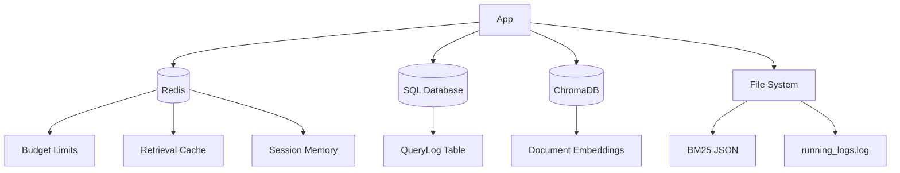
```mermaid
graph TD
    App --> Redis[(Redis)]
    App --> DB[(SQL Database)]
    App --> Vector[(ChromaDB)]
    App --> FileSys[File System]
    
    Redis --> Budget[Budget Limits]
    Redis --> Cache[Retrieval Cache]
    Redis --> Mem[Session Memory]
    
    DB --> QL[QueryLog Table]
    Vector --> Embed[Document Embeddings]
    FileSys --> BM25[BM25 JSON]
    FileSys --> Logs[running_logs.log]
```

### 9. Deployment Diagram
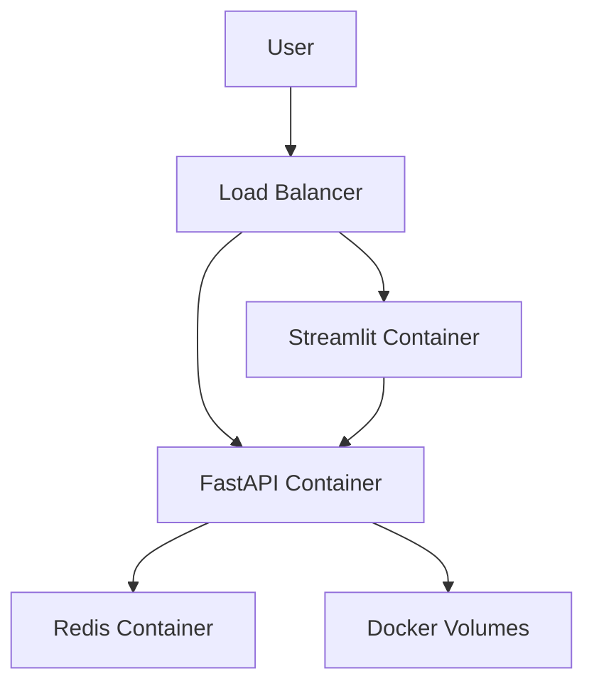
```mermaid
graph TD
    User --> Nginx[Load Balancer]
    Nginx --> Dashboard[Streamlit Container]
    Nginx --> API[FastAPI Container]
    
    API --> Redis[Redis Container]
    API --> Vols[Docker Volumes]
    Dashboard --> API
```

### 10. Configuration Flow
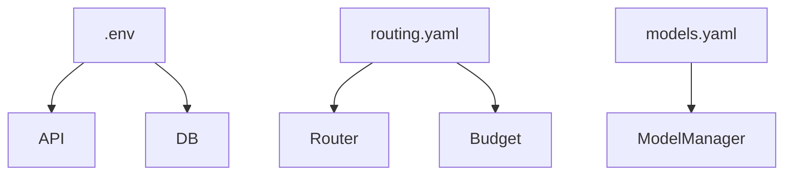
```mermaid
graph TD
    ENV[.env] --> API
    ENV --> DB
    YAML1[routing.yaml] --> Router
    YAML1 --> Budget
    YAML2[models.yaml] --> ModelManager
```

### 11. Error Handling Flow
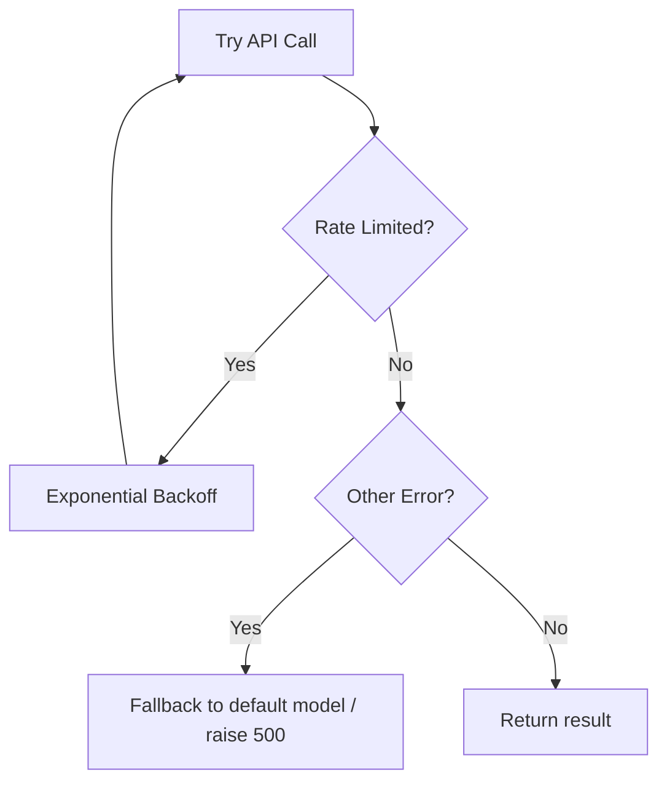
```mermaid
graph TD
    Try[Try API Call] --> Ratelimit{Rate Limited?}
    Ratelimit -- Yes --> Retry[Exponential Backoff]
    Retry --> Try
    Ratelimit -- No --> APIError{Other Error?}
    APIError -- Yes --> Fallback[Fallback to default model / raise 500]
    APIError -- No --> Success[Return result]
```

### 12. Logging & Monitoring Flow
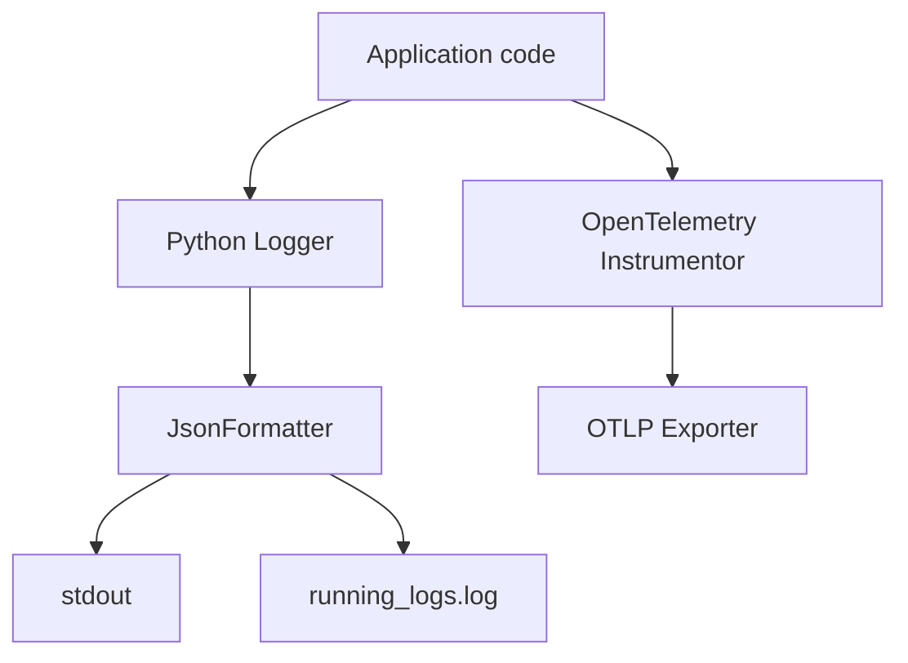
```mermaid
graph TD
    App[Application code] --> PyLog[Python Logger]
    PyLog --> JSON[JsonFormatter]
    JSON --> Stdout[stdout]
    JSON --> File[running_logs.log]
    
    App --> OTEL[OpenTelemetry Instrumentor]
    OTEL --> OTLP[OTLP Exporter]
```

### 13. Cost Tracking Flow
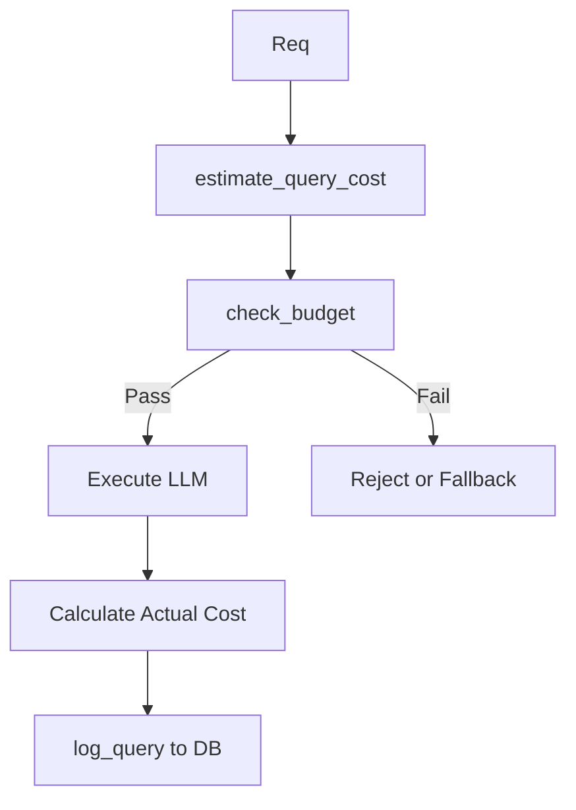
```mermaid
graph TD
    Req --> Est[estimate_query_cost]
    Est --> Chk[check_budget]
    Chk -- Pass --> Exec[Execute LLM]
    Chk -- Fail --> Block[Reject or Fallback]
    Exec --> Calc[Calculate Actual Cost]
    Calc --> Log[log_query to DB]
```

### 14. Authentication & Authorization Flow
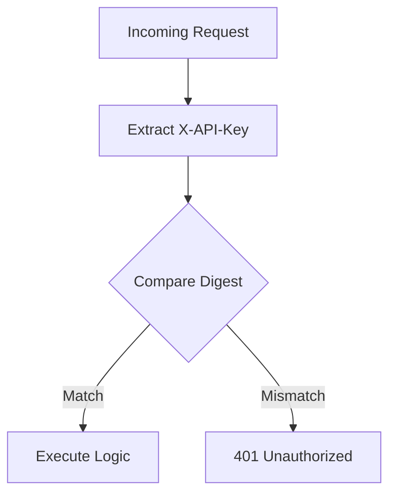
```mermaid
graph TD
    Req[Incoming Request] --> Header[Extract X-API-Key]
    Header --> Val{Compare Digest}
    Val -- Match --> Proceed[Execute Logic]
    Val -- Mismatch --> Reject[401 Unauthorized]
```

---

---

## 13. Production Architecture Observations
- **Concurrency**: Avoids `asyncio` for pipeline execution. Uses `run_in_executor` in FastAPI and `ThreadPoolExecutor` for hybrid search and batch inference. This circumvents strict async propagation requirements while maintaining API responsiveness.
- **Thread Safety**: Uses atomic Redis operations (`INCRBYFLOAT`) for budget tracking and SQLite WAL mode / SessionMaker patterns for database concurrency.
- **Security**: Prompt injection regex guards, constant-time token comparison (`secrets.compare_digest`), bounded memory arrays (FIFO eviction for session contexts to prevent context window bloat).

## 14. Potential Architectural Weaknesses
- **Synchronous Bottlenecks**: Deeply nested synchronous `ThreadPoolExecutor` usage (e.g. `batch_run` calling `run`, which calls hybrid retrieval thread pools) could lead to thread starvation under high concurrent API load.
- **In-Memory Fallbacks**: If Redis is absent, BudgetManager and ConversationMemory use process-local memory. In a multi-worker deployment (e.g., `uvicorn --workers 4`), this breaks consistency (session history will appear random across requests).
- **Hardcoded ML Paths**: Classifier model paths are hardcoded to `models/classifiers/complexity_classifier.pkl`, requiring a specific execution directory.

## 15. Suggested Improvements
1. **Fully Async Pipeline**: Migrate `InferencePipeline`, `GroqModel`, and `VectorStore` to async interfaces to drastically improve vertical scaling.
2. **PostgreSQL Migration**: Ensure production deployments strictly utilize PostgreSQL via `DATABASE_URL` instead of SQLite to completely eliminate write-locking risks under high QPS.
3. **Model Decoupling**: Abstract `GroqModel` behind an interface (e.g., `BaseLLM`) to allow drop-in replacements like OpenAI, Anthropic, or local vLLM instances without refactoring the pipeline.

---

