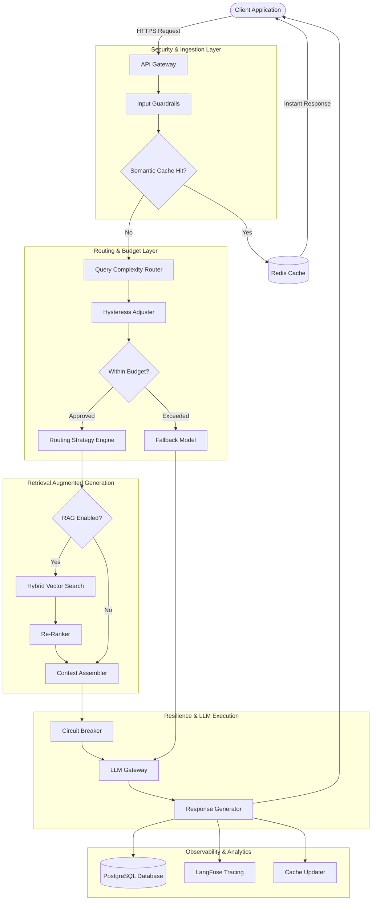
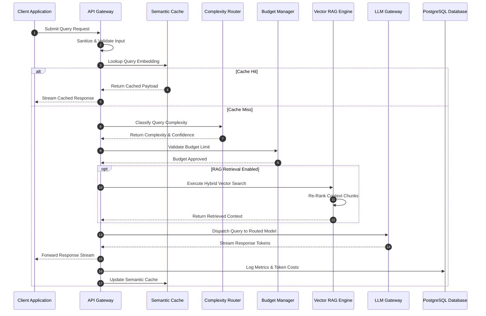

# SmartRoute-AI

**Cost-optimized LLM inference gateway with ML-based query routing and RAG.**

🚀 **Live:** [Click Here](https://smartroute-dashboard.onrender.com/) — Render single-service deployment via `render.yaml`

---

## Problem

Every LLM call goes through the same expensive, high-capability model even when the question is _"What is Python?"_ — a query any 9B model can answer correctly. SmartRoute-AI fixes that.

### Features
A **LightGBM classifier** (19 lexical + semantic features, `n_estimators=50`, `max_depth=4`, `num_leaves=15`) reads each incoming query and routes it to the smallest model that can handle it:

| Complexity | Model (`cost_optimized` strategy) | Max latency target |
|---|---|---|
| simple | `nvidia/nemotron-nano-9b-v2:free` | 3.0 s |
| medium | `openai/gpt-oss-20b:free` | 5.0 s |
| complex | `google/gemma-4-31b-it:free` | 10.0 s |

Uncertain `complex` classifications (confidence < 0.75) are demoted to `medium` via cost-biased hysteresis — conservative by design. Three routing strategies are configurable at query time: `cost_optimized` (default), `quality_first`, `balanced`.

On top of routing the system also provides:
- **RAG pipeline** — Qdrant native hybrid search (dense + sparse RRF fusion), HuggingFace cross-encoder reranker (`cross-encoder/ms-marco-MiniLM-L-6-v2`) with keyword-overlap local fallback, 500-token chunks with 50-token overlap.
- **Semantic cache** — query embeddings stored in Qdrant, payloads in Redis; hits return instantly without calling any LLM. Cache similarity threshold: `0.95`. TTL: 7 days.
- **Multi-turn memory** — conversation history stored in Redis, injected per `session_id`.
- **Budget enforcement** — atomic `INCRBYFLOAT` on Redis; daily $10, weekly $50, monthly $200 hard limits (configurable in `config/routing.yaml`). Alerts at 80% of any limit.
- **Guardrails** — 21 regex patterns for prompt injection blocking; 500-character hard query limit.
- **Full observability** — OpenTelemetry traces (OTLP, gRPC or HTTP) → LangFuse, per-query cost/token/latency logged to Supabase PostgreSQL.
- **RAGAS evaluation** — `faithfulness`, `answer_relevancy`, `context_recall`, `context_precision`; pass threshold set at 0.70 in `scripts/run_eval.py`.

---

## System Architecture


```mermaid
graph TD
    Client([Client Application]) -->|HTTPS Request| Gateway[API Gateway]
    
    subgraph Security & Ingestion Layer
        Gateway --> Guardrails[Input Guardrails]
        Guardrails --> CacheCheck{Semantic Cache Hit?}
    end

    CacheCheck -- Yes --> CacheStore[(Redis Cache)]
    CacheStore -->|Instant Response| Client

    CacheCheck -- No --> Router[Query Complexity Router]

    subgraph Routing & Budget Layer
        Router --> Hysteresis[Hysteresis Adjuster]
        Hysteresis --> BudgetCheck{Within Budget?}
        BudgetCheck -- Exceeded --> Fallback[Fallback Model]
        BudgetCheck -- Approved --> StrategyEngine[Routing Strategy Engine]
    end

    subgraph Retrieval Augmented Generation
        StrategyEngine --> RAGCheck{RAG Enabled?}
        RAGCheck -- Yes --> VectorSearch[Hybrid Vector Search]
        VectorSearch --> Reranker[Re-Ranker]
        Reranker --> ContextAssembler[Context Assembler]
        RAGCheck -- No --> ContextAssembler
    end

    subgraph Resilience & LLM Execution
        ContextAssembler --> CircuitBreaker[Circuit Breaker]
        CircuitBreaker --> LLMGateway[LLM Gateway]
        Fallback --> LLMGateway
        LLMGateway --> ResponseGen[Response Generator]
    end

    subgraph Observability & Analytics
        ResponseGen --> Database[(PostgreSQL Database)]
        ResponseGen --> Tracing[LangFuse Tracing]
        ResponseGen --> CacheWrite[Cache Updater]
    end

    ResponseGen --> Client
```

---

## End-to-End Query Lifecycle & State Machine


```mermaid
sequenceDiagram
    autonumber
    participant Client as Client Application
    participant Gateway as API Gateway
    participant Cache as Semantic Cache
    participant Router as Complexity Router
    participant Budget as Budget Manager
    participant RAG as Vector RAG Engine
    participant LLM as LLM Gateway
    participant DB as PostgreSQL Database

    Client->>Gateway: Submit Query Request
    Gateway->>Gateway: Sanitize & Validate Input
    Gateway->>Cache: Lookup Query Embedding
    alt Cache Hit
        Cache-->>Gateway: Return Cached Payload
        Gateway-->>Client: Stream Cached Response
    else Cache Miss
        Gateway->>Router: Classify Query Complexity
        Router-->>Gateway: Return Complexity & Confidence
        Gateway->>Budget: Validate Budget Limit
        Budget-->>Gateway: Budget Approved
        opt RAG Retrieval Enabled
            Gateway->>RAG: Execute Hybrid Vector Search
            RAG->>RAG: Re-Rank Context Chunks
            RAG-->>Gateway: Return Retrieved Context
        end
        Gateway->>LLM: Dispatch Query to Routed Model
        LLM-->>Gateway: Stream Response Tokens
        Gateway-->>Client: Forward Response Stream
        Gateway->>DB: Log Metrics & Token Costs
        Gateway->>Cache: Update Semantic Cache
    end
```

---

## RESTful API Endpoints

All business endpoints are versioned under `/v1` and require JWT Bearer Authentication (`Authorization: Bearer <TOKEN>`). Rate limiting is enforced per IP via SlowAPI.

| HTTP Method | Endpoint | Rate Limit | Auth Required | Description |
|---|---|---|---|---|
| `GET` | `/health` | Unthrottled | No | Cheap liveness check for Docker/Render. |
| `GET` | `/ready` | Unthrottled | No | Dependency readiness check for Redis, Qdrant, PostgreSQL, and pipeline components. |
| `GET` | `/version` | Unthrottled | No | Returns non-sensitive deployment identity (`commit_sha`, `build_time`) for release verification. |
| `GET` | `/` | Unthrottled | No | Serves the React app when built; otherwise returns service status and endpoint index. |
| `POST` | `/v1/query` | `30/min` | Yes | Synchronous end-to-end inference processing query routing, budget, RAG, and execution. |
| `POST` | `/v1/query/stream` | `30/min` | Yes | Server-Sent Events (SSE) streaming endpoint returning metadata, tokens, and cost breakdown. |
| `POST` | `/v1/query/batch` | `10/min` | Yes | Concurrent batch execution processing up to 10 queries per request payload. |
| `GET` | `/v1/stats` | `60/min` | Yes | Aggregate cost, token consumption, latency, and model breakdown analytics over $N$ days. |
| `GET` | `/v1/savings` | `60/min` | Yes | Calculates total financial cost savings relative to a $0.15 baseline LLM cost per query. |
| `GET` | `/v1/budget` | `60/min` | Yes | Upstash Redis budget status detailing daily ($10), weekly ($50), and monthly ($200) utilization. |
| `GET` | `/v1/models` | Unthrottled | Yes | Returns list of configured OpenRouter models and currently initialized model instances. |
| `DELETE` | `/v1/memory/{session_id}` | Unthrottled | Yes | Flushes conversation turn history for a given multi-turn session ID from Redis. |
| `POST` | `/v1/documents/upload` | Unthrottled | Yes | Uploads PDF, TXT, or MD files to Supabase Storage, records metadata, and indexes chunks in Qdrant. |
| `GET` | `/v1/documents` | Unthrottled | Yes | Lists active document metadata for the authenticated demo user. |
| `DELETE` | `/v1/documents/{filename}` | Unthrottled | Yes | Deletes the Supabase object, purges matching Qdrant vector points, and marks metadata deleted. |
| `DELETE` | `/v1/documents` | Unthrottled | Yes | Clears the authenticated demo user's documents from storage, vector index, and metadata. |

---

## Tech Stack

| Layer | Technology |
|---|---|
| API | FastAPI 0.109+, Uvicorn, SlowAPI rate limiter (30 req/min query, 10 req/min batch) |
| LLM routing | LightGBM 4.0+, scikit-learn 1.4+, fastembed (`BAAI/bge-small-en-v1.5`) |
| LLM inference | OpenRouter via `AsyncOpenAI` (base_url: `https://openrouter.ai/api/v1`) |
| RAG | LangChain, Qdrant Cloud (hybrid dense+sparse), HuggingFace Inference API |
| Semantic cache | Qdrant + Upstash Redis (7-day TTL) |
| Cost/budget DB | Supabase PostgreSQL via SQLAlchemy + Alembic migrations |
| Observability | OpenTelemetry SDK → LangFuse (OTLP HTTP/gRPC), structured JSON logs |
| Auth | HS256 JWT (`PyJWT`) |
| Frontend | React, TypeScript, Vite, Tailwind, Radix UI, Framer Motion |
| CI/CD | GitHub Actions CI gate, exact-commit Render deploy workflow, production `/version` verification |
| Python | 3.10 (pinned in `.python-version` and `pyproject.toml`) |

---

## Key Metrics

| Metric | Value | Description / Benchmark |
|---|---|---|
| **Classifier Test Accuracy** | **95.49%** | Evaluated on 731 stratified test queries (3,651 total dataset) |
| **Routing Macro F1-Score** | **0.9550** | `simple`: 0.975 \| `medium`: 0.941 \| `complex`: 0.949 |
| **RAGAS Quality Threshold** | **0.70+** | Minimum score across Faithfulness, Relevancy, Recall, & Precision |

---

## Setup

```bash
# 1. Clone and enter
git clone https://github.com/JavithNaseem-J/SmartRoute-AI.git
cd SmartRoute-AI

# 2. Install (Python 3.10 required)
pip install uv
uv pip install -e .

# 3. Configure environment
cp .env.example .env
# Fill in .env — required keys:
#   OPENROUTER_API_KEY   → https://openrouter.ai
#   SUPABASE_JWT_SECRET  → any string ≥ 32 chars
#   SUPABASE_URL         → https://<project-ref>.supabase.co
#   SUPABASE_SERVICE_ROLE_KEY → Supabase server-side service role key
#   SUPABASE_STORAGE_BUCKET   → private bucket for uploaded documents
#   HF_TOKEN             → https://huggingface.co/settings/tokens
#   DATABASE_URL         → postgresql://... (Supabase free tier works)
#   REDIS_URL            → redis://... (Upstash free tier works)
#   QDRANT_URL           → https://... (Qdrant Cloud free tier works)
#   QDRANT_API_KEY       → from Qdrant Cloud dashboard

# 4. Run DB migrations
alembic upgrade head

# 5. Train / retrain the complexity classifier
python scripts/train_classifier.py
# Saves model to models/classifiers/complexity_classifier.pkl

# 6. Install frontend dependencies
cd frontend
npm ci
cd ..

# 7. Start the API backend
uvicorn api.main:app --host 0.0.0.0 --port 8000
# or: python -m api.main

# 8. Start the React dev server (separate terminal)
cd frontend
npm run dev -- --port 5173
# Vite → http://localhost:5173, proxying API calls to http://localhost:8000

# 9. Run the test suite
pytest tests/ -v

# 10. Run RAGAS RAG evaluation (requires indexed documents)
python scripts/run_eval.py


```

### Docker

```bash
docker build -t smartroute-ai .
docker run --env-file .env -p 8000:8000 smartroute-ai
# App + API -> http://localhost:8000
```

The `Dockerfile` builds the React frontend, copies `frontend/dist` into the Python runtime image, trains the classifier, and starts one Uvicorn process on `${PORT:-8000}`. Uploaded documents are stored in Supabase Storage, metadata is stored in Supabase Postgres, and embeddings remain in Qdrant. Health checks call `/health`; `/ready` performs dependency checks.

---

## Deployment

Deployed on **Render** (Singapore region, free plan) via `render.yaml` as one Docker web service named `smartroute-ai`. Render injects `$PORT`; the container serves both React assets and `/v1/*` API routes from the same origin. Run `uv run alembic upgrade head` manually before deploying when migrations change, because Render free-tier services do not support pre-deploy commands.

Render `autoDeploy` is disabled. Production deploys are controlled by GitHub Actions:

1. `.github/workflows/ci.yml` runs on pushes to `main`, pull requests to `main`, and manual dispatch.
2. CI runs backend lint/format/type/test gates, frontend lockfile install/typecheck/test/build, npm audit, and a production Docker image smoke test.
3. `.github/workflows/deploy-render.yml` runs only after the `CI` workflow succeeds on `main`, or by manual dispatch for a SHA that already has a successful completed CI run.
4. The deploy workflow calls `RENDER_DEPLOY_HOOK_URL` with `ref=<exact-commit-sha>`.
5. GitHub waits for production `/version` and fails the deployment if the live `commit_sha` is not the exact SHA that passed CI.

Required GitHub configuration:

- Secret: `RENDER_DEPLOY_HOOK_URL`
- Repository or `production` environment variable: `PRODUCTION_BASE_URL` (for example, `https://smartroute-ai.onrender.com`)
- Environment: `production` (keep any approval protection enabled there)

---

## Project Structure

```
SmartRoute-AI/
├── api/
│   ├── main.py                  # FastAPI app setup, v1 business routes, frontend mount
│   ├── schemas.py               # API request/response schemas
│   └── system_routes.py         # Health, readiness, and deployment identity routes
├── frontend/                    # React + TypeScript console served by FastAPI in production
│   └── src/
│       ├── App.tsx              # SmartRoute chat shell and page composition
│       ├── components/          # Analytics and prompt UI components
│       ├── lib/                 # Auth, document API, formatting, chat/session helpers
│       └── types/               # Shared frontend types
├── config/
│   ├── routing.yaml             # Strategy definitions, budget limits, reference queries
│   └── models.yaml              # Model registry with cost per 1k tokens
├── src/
│   ├── routing/                 # LightGBM classifier, feature extraction (19 features), router
│   ├── pipeline/inference.py    # Full async pipeline orchestration
│   ├── retrieval/               # Qdrant indexer, hybrid retriever, HF reranker, semantic cache
│   ├── models/                  # OpenRouter async LLM wrapper (retry + circuit breaker)
│   ├── cost/                    # CostTracker (Supabase) + BudgetManager (Redis)
│   ├── memory/                  # Conversation history (Redis)
│   ├── evaluation/              # RAGAS eval harness
│   └── utils/                   # Guardrails, circuit breaker, alerting, OTel tracing
├── scripts/
│   ├── train_classifier.py      # LightGBM training + evaluation + save to .pkl
│   ├── generate_training_data.py
│   ├── generate_centroids.py
│   └── run_eval.py              # RAGAS evaluation runner
├── tests/                       # 9 pytest test files
├── data/
│   └── training/synthetic_queries.csv
├── models/classifiers/          # complexity_classifier.pkl (231 KB, pre-trained)
├── alembic/                     # DB migration scripts
├── openspec/changes/            # Active cleanup/specification changes
├── Dockerfile                   # React build + Python runtime image
└── render.yaml                  # Single-service Render deployment blueprint
```

---

## Future Work

- **Real benchmark numbers** — classifier accuracy was measured on 3,651 synthetic & rule-generated samples. Evaluating on a held-out human-labeled query set will give real-world domain confidence intervals.
- **Paid model cost tracking** — currently all three models are on `:free` tiers; the cost-per-1k fields in `config/models.yaml` are all 0.0 and will need updating once paid tiers are used.
- **Token-accurate counting** — `count_tokens` uses `len(text) // 4` (a heuristic). Replace with `tiktoken` or a model-specific tokenizer for precise billing.
- **Streaming batch endpoint** — `/v1/query/batch` returns full JSON; streaming SSE is not yet supported for batch.
- **Multi-collection RAG** — all indexed documents share a single `smartroute_docs` Qdrant collection; namespace isolation per user/project would enable multi-tenant deployments.

---

## License

This project is licensed under the [MIT License](file:///f:/DSML/SmartRoute-AI/LICENSE).
