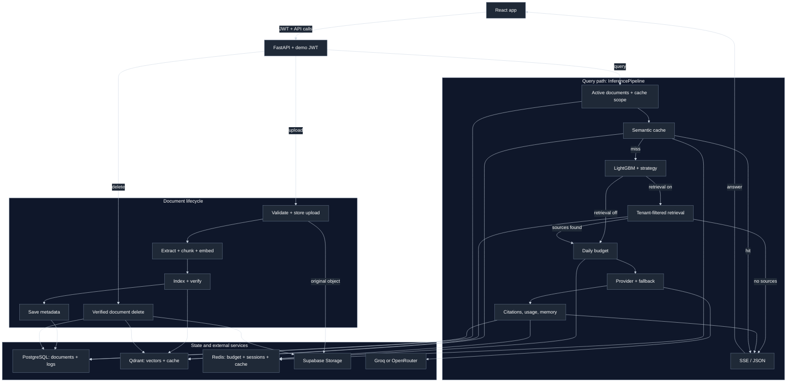

# SmartRoute-AI

**A chat application that routes requests to a configured LLM tier and can answer from a user's uploaded documents with source-linked citations.**

Click Here: [Live](https://smartroute-ai-r19a.onrender.com/)

Python · FastAPI · LightGBM · FastEmbed · Qdrant · Redis · PostgreSQL · React · Docker

SmartRoute-AI addresses two practical problems: sending every question to the same model, and answering document questions without a clear link to evidence. A classifier predicts query complexity; a selected strategy maps that prediction to an economy, balanced, or quality tier at one active provider. With document retrieval enabled, the application searches only the authenticated user's active uploads and streams answers with clickable filename, page, and excerpt details.

The repository includes a single-service Render deployment configuration. Demo availability and external service health were not checked for this README.

## Evidence

| Committed classifier evaluation | Result |
|---|---:|
| Training questions | 540 synthetic, unique examples |
| Held-out questions | 30 separately authored examples; zero normalized text overlap |
| Held-out accuracy | 86.67% |
| Held-out macro F1 | 0.8666 |

These numbers come from [the model metrics artifact](models/classifiers/complexity_classifier.metrics.json) and the [evaluation set](data/evaluation/routing_eval.json). The small held-out set is a regression signal, not evidence of general routing accuracy across real traffic. A separate [six-case offline dataset](data/evaluation/rag_eval.json) checks reranking of supplied passages; it does not exercise upload, Qdrant retrieval, answer generation, or factual support for citations. No end-to-end RAG quality or measured cost-saving result is published here.

## Architecture


```mermaid
%%{init: {"theme": "base", "themeVariables": {"background": "#0B1220", "primaryColor": "#1F2937", "primaryTextColor": "#FFFFFF", "primaryBorderColor": "#64748B", "secondaryColor": "#111827", "secondaryTextColor": "#FFFFFF", "tertiaryColor": "#0F172A", "tertiaryTextColor": "#FFFFFF", "lineColor": "#CBD5E1", "textColor": "#FFFFFF", "edgeLabelBackground": "#1F2937"}}}%%
flowchart TD
    UI["React app"] -->|JWT + API calls| API["FastAPI + demo JWT"]

    subgraph QUERY["Query path: InferencePipeline"]
        SCOPE["Active documents + cache scope"] --> CACHE["Semantic cache"]
        CACHE -->|miss| ROUTE["LightGBM + strategy"]
        ROUTE -->|retrieval on| RETRIEVE["Tenant-filtered retrieval"]
        ROUTE -->|retrieval off| BUDGET["Daily budget"]
        RETRIEVE -->|sources found| BUDGET
        RETRIEVE -->|no sources| RESPONSE["SSE / JSON"]
        BUDGET --> GENERATE["Provider + fallback"]
        GENERATE --> FINAL["Citations, usage, memory"]
        FINAL --> RESPONSE
        CACHE -->|hit| RESPONSE
    end

    subgraph DOCUMENTS["Document lifecycle"]
        UPLOAD["Validate + store upload"] --> PREP["Extract + chunk + embed"]
        PREP --> INDEX["Index + verify"]
        INDEX --> RECORD["Save metadata"]
        DELETE["Verified document delete"]
    end

    subgraph SERVICES["State and external services"]
        POSTGRES["PostgreSQL: documents + logs"]
        QDRANT["Qdrant: vectors + cache"]
        REDIS["Redis: budget + sessions + cache"]
        STORAGE["Supabase Storage"]
        PROVIDER["Groq or OpenRouter"]
    end

    API -->|query| SCOPE
    RESPONSE -->|answer| UI
    API -->|upload| UPLOAD
    API -->|delete| DELETE
    SCOPE --> POSTGRES
    CACHE --> QDRANT
    CACHE --> REDIS
    RETRIEVE --> QDRANT
    BUDGET --> REDIS
    GENERATE --> PROVIDER
    FINAL --> POSTGRES
    FINAL --> REDIS
    UPLOAD -->|original object| STORAGE
    INDEX --> QDRANT
    RECORD --> POSTGRES
    DELETE --> QDRANT
    DELETE --> STORAGE
    DELETE --> POSTGRES

    classDef default fill:#1F2937,stroke:#64748B,color:#FFFFFF
    style QUERY fill:#0F172A,stroke:#64748B,color:#FFFFFF
    style DOCUMENTS fill:#0F172A,stroke:#64748B,color:#FFFFFF
    style SERVICES fill:#0F172A,stroke:#64748B,color:#FFFFFF
```

- **Chat path:** The browser obtains a short-lived demo JWT, then uses the streaming `/v1/query/stream` endpoint. The backend emits routing metadata, answer chunks, replacement events when needed, and a terminal result.
- **Routing:** A committed LightGBM classifier uses lexical and centroid-based features. `config/routing.yaml` defines cost-optimized, balanced, and quality-first strategies; `config/models.yaml` maps logical tiers to model IDs for either Groq or OpenRouter. Only one provider is active per deployment.
- **Document path:** PDF, TXT, and Markdown uploads go to Supabase Storage. The API extracts text, splits it into chunks, creates local FastEmbed vectors, verifies Qdrant indexing, then records document metadata in PostgreSQL.
- **Grounding:** Qdrant searches filter by user ID and active document storage paths. Local keyword overlap reranks the dense-search candidates. Retrieved chunks receive citation IDs; the backend removes generated citation IDs absent from the retrieved set. If no source is found, it returns a no-document answer without calling the LLM.
- **State and telemetry:** Redis holds session history, semantic answer cache, and tenant-scoped daily budget reservations. PostgreSQL stores query logs and document records. JSON logs and optional OTLP/Langfuse traces provide telemetry. `/health` reports process liveness; `/ready` checks provider configuration and required services.

## Engineering decisions

- **One web image:** Docker builds the React app and serves it from FastAPI on the same origin. The Render blueprint deploys one web service and a Redis-compatible Key Value service. Frontend and API releases therefore move together.
- **Active-document allowlist:** Retrieval consults PostgreSQL before Qdrant search, so vectors left behind by a failed deletion are excluded from answers. Document deletion also waits for vector removal and checks the remaining count before marking the record deleted. These cross-service writes are ordered, but they are not one atomic transaction.
- **Explicit failure handling:** Provider calls retry selected transient errors and use a per-model circuit breaker. A configured fallback tier can be tried after failure. Streaming replaces partial failed output and finishes with a failed terminal result if generation cannot complete.
- **Budget before generation:** Redis atomically reserves an estimated daily amount per user. Generation stops when Redis budget enforcement is unavailable. Weekly and monthly figures are reporting limits rather than hard gates.

## Run locally

Requires Python 3.10, Node.js 22, `uv`, and reachable PostgreSQL, Redis, Qdrant, Supabase Storage, and one configured Groq or OpenRouter account. Copy `.env.example` to `.env` and fill in the required credentials and service URLs. Keep the file private.

```bash
uv sync --all-groups
cp .env.example .env
uv run alembic upgrade head
uv run uvicorn api.main:app --host 127.0.0.1 --port 8000
```

In another terminal:

```bash
cd frontend
npm ci
npm run dev -- --port 5173
```

The Vite dev server proxies API requests to port 8000. To inspect provider model availability before use, run `uv run python scripts/provider_predeploy.py`; that command contacts the configured provider. Local run commands above are documented from configuration and were not executed for this README.

## Verification

`uv run pytest tests/` covers routing, provider failure paths, budget behavior, tenant filters, document lifecycle, API responses, and cache behavior using fakes and mocks. `uv run python scripts/run_eval.py` runs the supplied-passage reranking check. In `frontend/`, `npm run lint`, `npm run typecheck`, `npm run build`, and `npm run test:e2e` cover the UI; Playwright intercepts API traffic. GitHub Actions also defines a Docker smoke job and a deployment workflow that checks the deployed commit and readiness. This audit inspected those checks but did not execute them.

## Limits

- The classifier trains on templated examples and has a small authored holdout. Routing quality and cost/answer-quality trade-offs have not been measured on representative user traffic.
- A valid citation ID proves that a retrieved chunk was supplied to the model; it does not verify every factual claim in the answer. Local reranking is lexical, and scanned PDFs need OCR before upload.
- `/v1/savings` compares logged cost with a fixed assumed cost per query, rather than a measured alternative system. Streaming token counts and therefore cost estimates use a character-based approximation.
- The public demo-token endpoint supplies session isolation without account identity. The Render blueprint's free Key Value plan can lose cache, memory, and budget-counter state on restart.

## FutureWork

1. **Add real user identity and access controls.** Replace public demo-token issuance for normal users, then test authorization across API, document, vector, and analytics paths.
2. **Make spending controls durable and accurate.** Use persistent Redis, reconcile estimated reservations with actual provider usage, and test restart and outage behavior.
3. **Evaluate the full document-answering path.** Build a representative, labeled set of uploads and questions; measure retrieval, answer support, citation accuracy, latency, and cost before setting release thresholds.
4. **Harden document lifecycle.** Add retry-safe upload and delete operations plus reconciliation for mismatches among Storage, Qdrant, and PostgreSQL.
5. **Exercise deployment and recovery.** Run migrations as a controlled deployment step, verify readiness and rollback, and load-test the service with monitoring and alerts enabled.

Licensed under the [MIT License](LICENSE).
